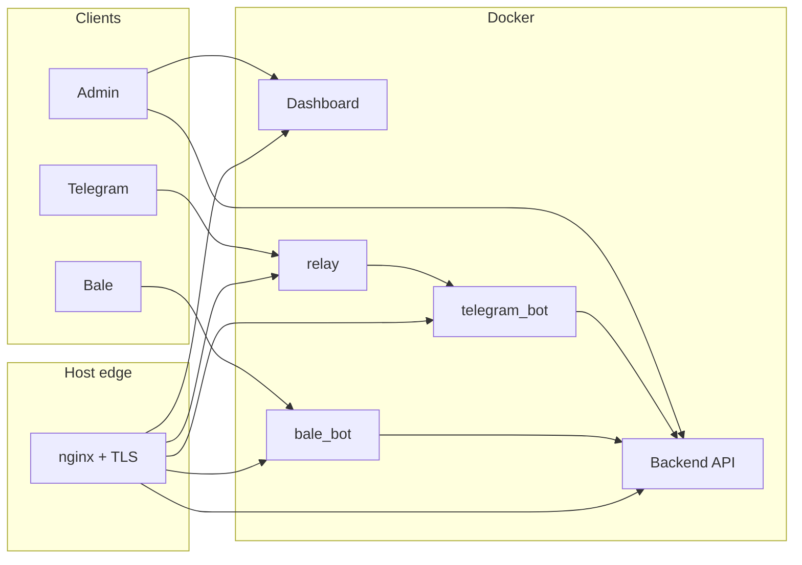

# MeowVPN

**Telegram & Bale VPN commerce platform** — admin dashboard, Laravel API, stateless bot workers, and an optional Telegram relay. Built for single-server or multi-host Docker deployment.

[](https://github.com/arsalanarghavan/MeowVPN)

---

## What's in the repo

| Path | Role |
|------|------|
| [`backend/`](backend/) | Laravel API, MySQL, Redis, commerce, bot processing |
| [`frontend/`](frontend/) | React admin dashboard (SPA) |
| [`telegram_bot/`](telegram_bot/) | Stateless Telegram webhook ingress → internal API |
| [`bale_bot/`](bale_bot/) | Stateless Bale webhook ingress → internal API |
| [`relay-server/`](relay-server/) | Telegram relay (public webhook + Bot API proxy) |
| [`docs/`](docs/) | Specs, runbooks, deployment guides |

Shared bot library: [`backend/packages/svp-bot-core/`](backend/packages/svp-bot-core/)



---

## Server requirements

- **OS:** Ubuntu 22.04+ or Debian 12+ (clean VPS)
- **Access:** `root` or `sudo`
- **Ports:** 80 and 443 open (SSL + webhooks)
- **DNS (recommended):** A records for each subdomain → server IP
- **Disk:** ≥ 5 GB free on `/var`
- **RAM:** ≥ 2 GB (installer adds 2 GB swap automatically on smaller VPS)

**On a fresh VPS you only need `curl` and `root`.** The bootstrap installs `git` if missing; the full installer provisions Docker, nginx, certbot, swap, and time-sync.

| Component | Where it runs |
|-----------|----------------|
| Docker + Compose | host (auto-installed) |
| nginx + certbot/acme | host (auto-installed) |
| PHP 8.3 / Laravel | **inside** `backend` containers |
| Node.js / npm (dashboard build) | **inside** `node:22-alpine` container |
| MySQL, Redis | **inside** Docker |

- Idempotent: safe to re-run the installer
- Log file: `backend/.install/install.log`
- Updates: `apt update` + install required packages only (no full distro upgrade)
- Retries: apt locks, network, Docker daemon, compose up, DB wait

---

## Install from GitHub

Repository: **https://github.com/arsalanarghavan/MeowVPN**

Review [install.sh](install.sh) on GitHub before piping to `bash`. Default branch: `main`.

### One-liner (recommended)

```bash
bash <(curl -fsSL https://raw.githubusercontent.com/arsalanarghavan/MeowVPN/main/install.sh)
```

Or:

```bash
curl -fsSL https://raw.githubusercontent.com/arsalanarghavan/MeowVPN/main/install.sh | sudo bash
```

Non-interactive:

```bash
curl -fsSL https://raw.githubusercontent.com/arsalanarghavan/MeowVPN/main/install.sh | sudo bash -s -- \
  --mode all \
  --non-interactive \
  --core-domain api.example.com \
  --dashboard-domain panel.example.com \
  --telegram-domain tg.example.com \
  --bale-domain bale.example.com \
  --relay-domain relay.example.com \
  --ssl certbot \
  --email admin@example.com
```

Update an existing install (git pull + rebuild + migrate):

```bash
curl -fsSL https://raw.githubusercontent.com/arsalanarghavan/MeowVPN/main/install.sh | sudo bash -s -- --update-only
```

Another branch: `MEOWVPN_BRANCH=develop bash <(curl -fsSL .../main/install.sh)`

Install directory: `/opt/meowvpn` (override with `MEOWVPN_DIR`).

### Manual clone (alternative)

```bash
sudo git clone https://github.com/arsalanarghavan/MeowVPN.git /opt/meowvpn
cd /opt/meowvpn
sudo bash backend/scripts/ops/install.sh
```

### Interactive menu

| # | Option | What it installs |
|---|--------|------------------|
| 1 | **Install All** | Full stack on one server |
| 2 | **Install Dashboard** | Backend + frontend |
| 3 | **Install Telegram Bot** | `telegram_bot` worker only |
| 4 | **Install Bale Bot** | `bale_bot` worker only |
| 5 | **Install Dashboard Backend** | API, DB, queue worker |
| 6 | **Install Dashboard Frontend** | SPA only |
| 7 | **Install Relay** | Telegram relay (systemd; separate from Docker relay in option 1) |

### Domains (Install All)

| Prompt | Service | Example |
|--------|---------|---------|
| Dashboard Core Domain | Laravel API | `api.example.com` |
| Dashboard Domain | React SPA | `panel.example.com` |
| Telegram Bot Domain | Telegram webhook worker | `tg.example.com` |
| Bale Bot Domain | Bale webhook worker | `bale.example.com` |
| Relay Domain | Telegram relay | `relay.example.com` |

- **Leave blank** → server public IP, HTTP only (no Let's Encrypt)
- **Hostname set** → TLS via **certbot** or **acme.sh**

### Non-interactive flags (after clone or via curl `-s --`)

```bash
cd /opt/meowvpn

sudo bash backend/scripts/ops/install.sh \
  --mode all \
  --non-interactive \
  --core-domain api.example.com \
  --dashboard-domain panel.example.com \
  --telegram-domain tg.example.com \
  --bale-domain bale.example.com \
  --relay-domain relay.example.com \
  --ssl certbot \
  --email admin@example.com
```

**`--mode` values:** `all` · `dashboard` · `backend` · `frontend` · `telegram` · `bale` · `relay`

### After install

- **Dashboard login:** user `admin` — password in `backend/.env` (`SVP_ADMIN_PASSWORD`) or printed by the installer
- Set bot tokens in the dashboard → **Bots**
- Webhooks are registered automatically; re-run after adding tokens if needed:

```bash
cd /opt/meowvpn/backend
sudo docker compose exec -T app php artisan svp:register-webhooks --platform=both
```

**Smoke checks:**

```bash
curl -fsS https://api.example.com/health/ready
curl -fsS https://panel.example.com/
```

---

## Multi-server deployment

Install **one menu option per server**. Bot hosts need the **Dashboard Core URL** (e.g. `https://api.example.com`).

```bash
# Server 1 — API + dashboard
cd /opt/meowvpn
sudo bash backend/scripts/ops/install.sh --mode dashboard --non-interactive \
  --core-domain api.example.com \
  --dashboard-domain panel.example.com \
  --ssl certbot --email you@example.com

# Server 2 — Telegram worker
sudo bash backend/scripts/ops/install.sh --mode telegram
# When prompted: Core URL = https://api.example.com

# Server 3 — Bale worker
sudo bash backend/scripts/ops/install.sh --mode bale

# Server 4 — Relay (optional)
sudo bash backend/scripts/ops/install.sh --mode relay
```

Details: [`docs/DEPLOYMENT-MULTI-HOST.md`](docs/DEPLOYMENT-MULTI-HOST.md)

---

## Local development

```bash
git clone https://github.com/arsalanarghavan/MeowVPN.git
cd MeowVPN

cp backend/.env.example backend/.env
# Set APP_KEY, DB_PASSWORD, SVP_BOT_SERVICE_SECRET

bash frontend/scripts/build.sh

cd backend
docker compose \
  -f docker-compose.yml \
  -f scripts/ops/install/docker-compose.install.override.yml \
  --profile workers --profile full up -d --build

docker compose exec -T app php artisan key:generate
docker compose exec -T app php artisan migrate --force
docker compose exec -T app php artisan db:seed --class=AdminUserSeeder --force
```

| Service | Local URL |
|---------|-----------|
| API | http://127.0.0.1:8080/api/v1 |
| Dashboard | http://127.0.0.1:3001 |
| Health | http://127.0.0.1:8080/health/ready |

---

## Updating from GitHub

```bash
curl -fsSL https://raw.githubusercontent.com/arsalanarghavan/MeowVPN/main/install.sh | sudo bash -s -- --update-only
```

Or manually:

```bash
cd /opt/meowvpn
sudo git pull origin main

cd backend
sudo docker compose \
  -f docker-compose.yml \
  -f scripts/ops/install/docker-compose.install.override.yml \
  --profile workers --profile full up -d --build

sudo docker compose exec -T app php artisan migrate --force
```

Install state and secrets live in `backend/.install/state.env` (gitignored; survives `git pull`).

---

## Documentation

| Doc | Topic |
|-----|--------|
| [`docs/DEPLOYMENT-MULTI-HOST.md`](docs/DEPLOYMENT-MULTI-HOST.md) | Docker profiles, domains, firewall |
| [`docs/RUNBOOK-PRODUCTION-FA.md`](docs/RUNBOOK-PRODUCTION-FA.md) | Production operations |
| [`backend/README.md`](backend/README.md) | API & Artisan commands |

---

## Repository

- **GitHub:** [github.com/arsalanarghavan/MeowVPN](https://github.com/arsalanarghavan/MeowVPN)
- **Issues & features:** use the repo Issues tab
