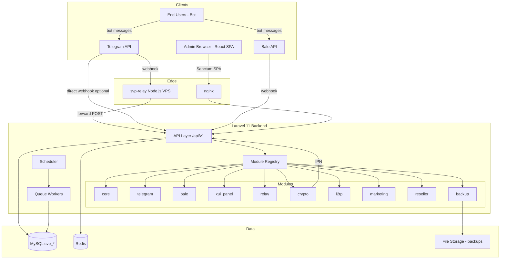
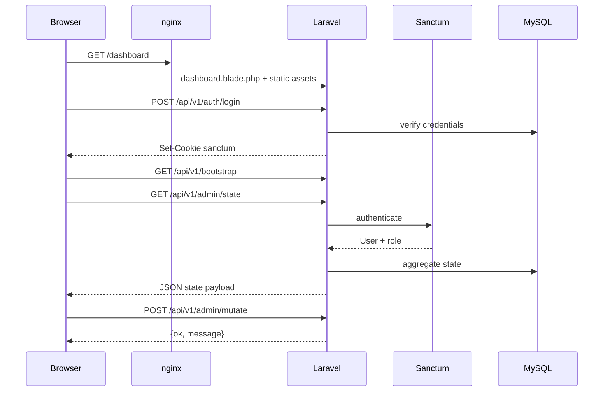
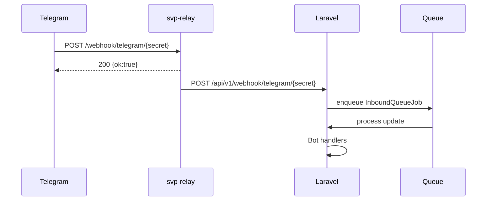

# مشخصات فنی Backend — مهاجرت SimpleVPBot از WordPress به Laravel 11

> **نسخه سند:** 1.0  
> **تاریخ:** ۱۴۰۵/۰۳/۲۱ (۲۰۲۶-۰۶-۱۱)  
> **مخاطب:** تیم توسعه Backend، DevOps، و Frontend Dashboard  
> **وضعیت:** پیش‌نویس مشخصات اجرایی (Implementation Spec)

---

## فهرست

1. [مقدمه و اهداف](#۱-مقدمه-و-اهداف)
2. [تصمیم‌های معماری](#۲-تصمیم‌های-معماری)
3. [دیاگرام معماری](#۳-دیاگرام-معماری)
4. [ساختار Monorepo](#۴-ساختار-monorepo)
5. [Docker Compose](#۵-docker-compose)
6. [سیستم ماژول‌ها](#۶-سیستم-ماژول‌ها)
7. [API Mapping (WP → Laravel)](#۷-api-mapping-wp--laravel)
8. [Authentication & Authorization](#۸-authentication--authorization)
9. [Secret Management](#۹-secret-management)
10. [Permission Matrix (Reseller)](#۱۰-permission-matrix-reseller)
11. [Database — ۴۳ جدول `svp_*`](#۱۱-database--۴۳-جدول-svp_)
12. [Cron / Scheduler — ۱۴ Job](#۱۲-cron--scheduler--۱۴-job)
13. [Webhook Ingress](#۱۳-webhook-ingress)
14. [صفحه‌به‌صفحه Dashboard](#۱۴-صفحه‌به‌صفحه-dashboard)
15. [لیست کامل Mutate Ops](#۱۵-لیست-کامل-mutate-ops)
16. [فازبندی ۰–۱۲](#۱۶-فازبندی-۰۱۲)
17. [Migration WP → Laravel](#۱۷-migration-wp--laravel)
18. [Observability، Rate Limits، Error Format](#۱۸-observability-rate-limits-error-format)

---

## ۱. مقدمه و اهداف

### ۱.۱ زمینه

SimpleVPBot یک پلتفرم مدیریت VPN/پروکسی مبتنی بر ربات تلگرام/بله و پنل 3x-ui است. **نسخه فعلی (runtime):** Backend **Laravel 11** در [`backend/`](../backend/) با **Dashboard Next App Router** ([`frontend/`](../frontend/)) و **Relay Node.js** ([`relay-server/`](../relay-server/)). کد WP legacy در [`archive/wp-plugin-root/`](../archive/wp-plugin-root/) آرشیو شده است.

### ۱.۲ هدف مهاجرت

جایگزینی کامل لایه Backend از WordPress با **Laravel 11**، بدون بازنویسی Dashboard React و بدون تغییر قرارداد API سمت کلاینت (تا حد امکان). Relay Server مستقل باقی می‌ماند.

### ۱.۳ اهداف کلیدی

| هدف | معیار موفقیت |
|-----|-------------|
| حذف وابستگی WP | هیچ endpoint تولیدی به `wp-json` یا `admin-ajax.php` وابسته نباشد |
| حفظ Dashboard | Next App Router در `frontend/src/app/[locale]/dashboard/`؛ API `admin/state` + mutate بدون breaking |
| ماژولار بودن | هر قابلیت (telegram، bale، relay، crypto، l2tp، …) قابل enable/disable |
| داده یکسان | ۴۳ جدول `svp_*` + settings با `wp:import` قابل مهاجرت |
| امنیت | Sanctum، secret rotation، rate limit، audit log |
| عملیات | ۱۴ scheduled job معادل WP-Cron |
| Observability | structured logging، health check، metrics پایه |

### ۱.۴ خارج از محدوده (Out of Scope)

- بازنویسی `frontend` (فقط تغییر `restUrl` / `apiBase`)
- جایگزینی Relay با سرویس دیگر
- مهاجرت کاربران WP (`wp_users`) — فقط اپراتورهای dashboard به `users` لاراول
- Multi-tenant SaaS — هر deploy = یک tenant

### ۱.۵ منابع مرجع کد فعلی

> **v26:** WP sources archived under [`archive/wp-plugin-root/includes/`](../archive/wp-plugin-root/includes/). Runtime equivalents in `backend/app/`.

| فایل (آرشیو WP) | Laravel runtime |
|-----------------|-----------------|
| `archive/wp-plugin-root/includes/admin/class-dashboard-admin-mutations.php` | `MutateController` + `app/Services/Mutations/*` |
| `archive/wp-plugin-root/includes/api/class-rest-dashboard.php` | `routes/api.php` + `AdminStateController` |
| `frontend/src/config/admin-nav.ts` | ناوبری و tab keys (unchanged) |
| `archive/wp-plugin-root/includes/cron/class-cron-manager.php` | `routes/console.php` |
| `relay-server/SETUP-GUIDE-FA.md` | ماژول relay |

---

## ۲. تصمیم‌های معماری

### ۲.۱ حذف WordPress

| قبل (WP) | بعد (Laravel) |
|----------|---------------|
| `get_option('simplevpbot_settings')` | جدول `svp_settings` + `SettingsRepository` |
| `wp_users` + meta | جدول `users` + Spatie Permission / custom roles |
| `rest_api_init` | `routes/api.php` + `RouteServiceProvider` |
| `wp-cron.php` | `php artisan schedule:run` + Supervisor |
| `wp_remote_post` | `Http::` facade + Guzzle |
| `dbDelta` migrations | Laravel migrations |
| `admin-ajax.php` portal | `POST /api/v1/portal/{signed}` |

**اصل:** هیچ فایل PHP وردپرس در production باقی نماند.

### ۲.۲ Dashboard (Next App Router)

- Build فرانت: `npm run build` (Next) — dev `npm run dev`
- API calls از browser: `/api/v1/*` (Sanctum cookie) — see `frontend/src/lib/dash-admin-mutate.ts`
- Legacy Vite SPA: archived (`frontend/src/_vite_legacy_archive/`, `frontend-vite-legacy/`)
- احراز هویت: **Laravel Sanctum** (SPA cookie برای same-origin)
- Header قدیمی `X-WP-Nonce` → `X-XSRF-TOKEN` + `Authorization: Bearer` (اختیاری)

> **v29 amendment:** Runtime routes are `/[locale]/dashboard/{tab}` (e.g. `/fa/dashboard/payments`), not `/dashboard?tab=`. Site settings subtabs: `/[locale]/dashboard/site_settings?site_subtab=…`. Component mapping: `frontend/src/app/[locale]/dashboard/[tab]/page.tsx` → `frontend/src/components/admin/*-admin-client.tsx`.

### ۲.۳ Docker-first Deployment

```
┌─────────────┐     ┌──────────────┐     ┌─────────────┐
│   web       │────▶│  app         │────▶│   mysql     │
│  (nginx)    │     │  (php-fpm)   │     │   8.4       │
└─────────────┘     └──────────────┘     └─────────────┘
       │                    │
       │                    ├── redis (cache, queue, RL)
       │                    └── scheduler + queue-worker (profile workers)
       ▼
┌─────────────┐
│  dashboard  │  (static از public/dashboard)
└─────────────┘
```

### ۲.۴ Module System

هر ماژول = `app/Modules/{Name}/` با:
- `ModuleServiceProvider`
- `routes.php` (اختیاری)
- `config.php` → `config/modules.php` registry
- Flag: `SVP_MODULE_{NAME}=true` (see `config/modules.php`; legacy alias `MODULE_{NAME}_ENABLED`)

### ۲.۵ Queue Strategy

> **v23 amendment:** Production uses Redis `queue-worker` (Docker profile) instead of Laravel Horizon or `database` driver. See [`QUEUE-HORIZON-DEVIATION-FA.md`](QUEUE-HORIZON-DEVIATION-FA.md).

| نوع کار | مکانیزم (runtime v23) |
|---------|---------|
| Broadcast send | Redis queue + `BroadcastWorkerJob` |
| Users bulk | Redis queue + `UsersBulkWorkerJob` |
| Webhook async | `InboundQueueJob` (معادل `svp_inbound_queue`) |
| Deferred bot ops | Laravel `dispatch()->afterResponse()` |
| Backup | scheduled + manual dispatch |

### ۲.۶ Database

- MySQL 8.0+ (همان engine فعلی)
- Prefix جداول: `svp_` (بدون `wp_`)
- JSON columns برای `meta_json` fields
- Soft delete فقط جایی که WP داشت (services: خیر)

---

## ۳. دیاگرام معماری



### ۳.۱ جریان درخواست Dashboard



### ۳.۲ جریان Webhook با Relay



---

## ۴. ساختار Monorepo

```
simplevpbot/
├── backend/                          # Laravel 11 application
│   ├── app/
│   │   ├── Http/Controllers/Api/V1/
│   │   ├── Models/                   # SvpUser, SvpService, ...
│   │   ├── Modules/
│   │   │   ├── Core/
│   │   │   ├── Telegram/
│   │   │   ├── Bale/
│   │   │   ├── XuiPanel/
│   │   │   ├── Relay/
│   │   │   ├── Crypto/
│   │   │   ├── L2tp/
│   │   │   ├── Marketing/
│   │   │   ├── Reseller/
│   │   │   └── Backup/
│   │   ├── Jobs/                     # Cron job classes
│   │   ├── Services/                 # Domain services
│   │   └── Console/Commands/
│   │       └── WpImportCommand.php   # wp:import
│   ├── config/modules.php
│   ├── database/migrations/
│   ├── routes/api.php
│   └── tests/
├── frontend/                         # React SPA
│   ├── src/
│   ├── shared/locales/               # i18n مشترک
│   └── dist/                         # خروجی build
├── relay-server/                     # Node relay
└── docs/
    └── LARAVEL-BACKEND-SPEC-FA.md    # این سند
```

### ۴.۱ قرارداد نام‌گذاری Laravel

| WP Class | Laravel Equivalent |
|----------|-------------------|
| `SimpleVPBot_Model_User` | `App\Models\SvpUser` |
| `SimpleVPBot_Rest_Dashboard` | `App\Http\Controllers\Api\V1\DashboardController` |
| `SimpleVPBot_Dashboard_Admin_Mutations` | `App\Services\Dashboard\MutateDispatcher` |
| `SimpleVPBot_Cron_Manager` | `App\Console\Kernel` + `routes/console.php` |
| `SimpleVPBot_Settings` | `App\Services\SettingsService` |

---

## ۵. Docker Compose

### ۵.۱ سرویس‌ها

> **v24 amendment:** Docker Compose service for nginx is named `web` (not `nginx`). MySQL image is `mysql:8.4`.

| سرویس | Image | پورت | نقش |
|--------|-------|------|-----|
| `web` | nginx:1.27-alpine | 80, 443 | reverse proxy، static dashboard |
| `app` | php:8.3-fpm (custom) | 9000 | Laravel application |
| `mysql` | mysql:8.4 | 3306 | primary database |
| `redis` | redis:7-alpine | 6379 | cache، queue، rate limit |
| `scheduler` | same as app | — | `schedule:work` |
| `queue-worker` | same as app | — | `queue:work redis` (profile `workers`) |
| `relay` | optional profile | 8787 | فقط dev local؛ prod روی VPS جدا |

### ۵.۲ `docker-compose.yml` (نمونه)

```yaml
services:
  web:
    image: nginx:1.27-alpine
    ports: ["8080:80"]
    volumes:
      - ./backend:/var/www/html
      - ./docker/nginx/default.conf:/etc/nginx/conf.d/default.conf
    depends_on: [app]

  app:
    build: ./docker/php
    volumes: ["./backend:/var/www/html"]
    environment:
      APP_ENV: local
      DB_HOST: mysql
      REDIS_HOST: redis
    depends_on: [mysql, redis]

  mysql:
    image: mysql:8.4
    environment:
      MYSQL_DATABASE: simplevpbot
      MYSQL_ROOT_PASSWORD: secret
    volumes: ["svp_mysql:/var/lib/mysql"]

  redis:
    image: redis:7-alpine

  scheduler:
    build: ./docker/php
    command: php artisan schedule:work
    volumes: ["./backend:/var/www/html"]
    depends_on: [app]

  queue:
    build: ./docker/php
    command: php artisan queue:work --sleep=1 --tries=3
    volumes: ["./backend:/var/www/html"]
    depends_on: [app]

volumes:
  svp_mysql:
```

### ۵.۳ متغیرهای محیطی نمونه (`.env`)

```env
APP_NAME=SimpleVPBot
APP_URL=https://panel.example.com
APP_KEY=base64:...

DB_CONNECTION=mysql
DB_HOST=mysql
DB_PORT=3306
DB_DATABASE=simplevpbot
DB_USERNAME=svp
DB_PASSWORD=...

REDIS_HOST=redis
CACHE_DRIVER=redis
QUEUE_CONNECTION=redis
SESSION_DRIVER=redis

# Modules (runtime env prefix: SVP_MODULE_* — see config/modules.php)
SVP_MODULE_TELEGRAM=true
SVP_MODULE_BALE=true
SVP_MODULE_XUI_PANEL=true
SVP_MODULE_RELAY=false
SVP_MODULE_CRYPTO=false
SVP_MODULE_L2TP=false
SVP_MODULE_MARKETING=true
SVP_MODULE_RESELLER=true
SVP_MODULE_BACKUP=true
# Legacy alias (doc only): MODULE_*_ENABLED → same as SVP_MODULE_*

# Sanctum
SANCTUM_STATEFUL_DOMAINS=panel.example.com,localhost:8080
SESSION_DOMAIN=.example.com

# Secrets (see section 9)
SVP_TELEGRAM_TOKEN=
SVP_TELEGRAM_WEBHOOK_SECRET=
SVP_BALE_TOKEN=
SVP_BALE_WEBHOOK_SECRET=
SVP_RELAY_SHARED_SECRET=
SVP_CRYPTO_IPN_PATH_SECRET=
SVP_CRYPTO_NOWPAYMENTS_API_KEY=
SVP_CRYPTO_NOWPAYMENTS_IPN_SECRET=
SVP_PORTAL_LINK_SECRET=
SVP_QUEUE_DRAIN_KEY=

# Relay (when SVP_MODULE_RELAY=true)
SVP_RELAY_VPS_IP=
SVP_RELAY_ADMIN_URL=https://203.0.113.5
SVP_RELAY_PUBLIC_URL=https://tg.example.com
SVP_RELAY_SSL_VERIFY=false

# Backup
SVP_BACKUP_INTERVAL_MINUTES=60
SVP_BACKUP_STORE_ON_SITE=true
SVP_BACKUP_TELEGRAM_CHAT_ID=

# Rate limits
SVP_WEBHOOK_RATE_LIMIT_PER_MIN=120
SVP_WEBHOOK_RESELLER_RATE_LIMIT_PER_MIN=60
```

---

## ۶. سیستم ماژول‌ها

### ۶.۱ جدول ماژول‌ها

| ماژول | Env Flag | پیش‌فرض | وابستگی‌ها | توضیح |
|-------|----------|---------|------------|-------|
| **core** | `SVP_MODULE_CORE` (always on) | `true` | — | users، services، plans، settings، audit، texts |
| **telegram** | `SVP_MODULE_TELEGRAM` | `true` | core | webhook، handlers، keyboards |
| **bale** | `SVP_MODULE_BALE` | `true` | core | webhook بله، handlers |
| **xui_panel** | `SVP_MODULE_XUI_PANEL` | `true` | core | panels، configs sync، provision |
| **relay** | `SVP_MODULE_RELAY` | `false` | telegram | Telegram relay VPS integration |
| **crypto** | `SVP_MODULE_CRYPTO` | `false` | core | NOWPayments IPN |
| **l2tp** | `SVP_MODULE_L2TP` | `false` | core | `svp_l2tp_servers`، bot L2TP flows |
| **marketing** | `SVP_MODULE_MARKETING` | `true` | core | rules، offers، idle cron |
| **reseller** | `SVP_MODULE_RESELLER` | `true` | core, telegram/bale | wholesale، bot profiles، permissions |
| **backup** | `SVP_MODULE_BACKUP` | `true` | core | zip backup، restore، cron |

> **v23 amendment:** Commerce mutations live in Core (`CommerceMutations`); no standalone module flag. **v24:** table above uses canonical `SVP_MODULE_*` env names (legacy doc alias `MODULE_*_ENABLED` = same keys).

### ۶.۲ قوانین Enable/Disable

1. **core** غیرقابل غیرفعال‌سازی — پایه سیستم
2. غیرفعال کردن **telegram** → tabهای relay و bot telegram مخفی؛ webhook 503
3. غیرفعال کردن **xui_panel** → tabs `xui_panels`، `configs` مخفی؛ provision متوقف
4. غیرفعال کردن **reseller** → tabs نمایندگی مخفی؛ `owner_svp_user_id` فقط 0
5. غیرفعال کردن **l2tp** → `features.l2tp=false` در bootstrap؛ tab `l2tp_servers` حذف
6. غیرفعال کردن **relay** → مستقیم webhook به Laravel (یا بدون relay)
7. غیرفعال کردن **crypto** → کارت `crypto_auto` در UI غیرفعال
8. غیرفعال کردن **backup** → cron backup و tab backup مخفی
9. غیرفعال کردن **marketing** → cron marketing/idle، tab lifecycle، **broadcast tab/cron** مخفی

### ۶.۳ `config/modules.php` (نمونه — v26 runtime shape)

```php
return [
    'modules' => [
        'telegram' => [
            'enabled' => svp_module_env('SVP_MODULE_TELEGRAM', 'MODULE_TELEGRAM_ENABLED', true),
            'label' => 'Telegram Bot',
            'depends' => ['core'],
            'provider' => \App\Modules\Telegram\TelegramServiceProvider::class,
        ],
        // ... bale, xui_panel, relay, crypto, l2tp, marketing, reseller, backup
    ],
];
```

See [`backend/config/modules.php`](../backend/config/modules.php) for full registry.

### ۶.۴ Boot Sequence

```
1. Load ModuleServiceProviders (topological sort by requires)
2. Register routes per enabled module
3. Register scheduled jobs per module
4. Expose enabled features in GET /dashboard/bootstrap → features{}
```

---

## ۷. API Mapping (WP → Laravel)

Namespace قدیمی: `simplevpbot/v1` → جدید: `api/v1`

### ۷.۱ Dashboard — Auth & Session

> **v27 amendment:** `frontend/src/lib/api-base.ts` `normalizeAdminApiPath()` rewrites only `/dashboard/admin/*` → `/admin/*`. Session paths (`/dashboard/persona`, `/dashboard/ui-preferences`, `/dashboard/impersonate/*`) keep the `/dashboard/` prefix. nginx rewrite in `default.conf` applies the same scope (admin alias only).

| WP Route | Method | Laravel Route | Controller@method | Auth |
|----------|--------|---------------|-------------------|------|
| `/dashboard/bootstrap` | GET | `/api/v1/bootstrap` | `BootstrapController` (invokable) | sanctum (optional) |
| `/dashboard/login` | POST | `/api/v1/auth/login` | `AuthController@login` | public |
| — | POST | `/api/v1/auth/logout` | `AuthController@logout` | sanctum |
| — | POST | `/api/v1/auth/token` | `AuthController@token` | public (API token) |
| `/dashboard/me/state` | GET | `/api/v1/me/state` | `DashboardSessionController@meState` | sanctum |
| — | GET | `/api/v1/me/portal` | `UserPortalController` (invokable) | sanctum |
| `/dashboard/persona` | POST | `/api/v1/dashboard/persona` | `DashboardSessionController@setPersona` | sanctum |
| `/dashboard/ui-preferences` | POST | `/api/v1/dashboard/ui-preferences` | `DashboardSessionController@uiPreferences` | sanctum |
| `/dashboard/impersonate/start` | POST | `/api/v1/dashboard/impersonate/start` | `ImpersonationController@start` | admin |
| `/dashboard/impersonate/stop` | POST | `/api/v1/dashboard/impersonate/stop` | `ImpersonationController@stop` | sanctum |

> **v28:** `/api/v1/admin/impersonate/start|stop` are also registered (same handlers as session paths above).

### ۷.۲ Dashboard — Admin State & Reads

> **v25 amendment:** SPA uses canonical `/api/v1/admin/*` and `/api/v1/auth/login`. nginx also rewrites `/api/v1/dashboard/admin/*` → `/api/v1/admin/*` — see [`NGINX-DASHBOARD-API-ALIAS-FA.md`](NGINX-DASHBOARD-API-ALIAS-FA.md).

> **v26 amendment:** Canonical Laravel routes use `/api/v1/admin/*`. Legacy WP paths `/api/v1/dashboard/admin/*` are registered as aliases in `routes/api.php` and via nginx rewrite — see [`NGINX-DASHBOARD-API-ALIAS-FA.md`](NGINX-DASHBOARD-API-ALIAS-FA.md).

| WP Route | Method | Canonical Laravel | Controller@method | Auth |
|----------|--------|-------------------|-------------------|------|
| `/dashboard/admin/state` | GET | `/api/v1/admin/state` | `AdminStateController` (invokable) | admin\|reseller |
| `/dashboard/admin/user/{id}` | GET | `/api/v1/admin/user/{id}` | `AdminUserController@show` | admin\|reseller |
| `/dashboard/admin/user-search` | GET | `/api/v1/admin/user-search` | `AdminUserController@search` | admin\|reseller |
| `/dashboard/admin/inbound-display-catalog` | GET | `/api/v1/admin/inbound-display-catalog` | `InboundDisplayCatalogController` (invokable) | admin\|reseller |
| `/dashboard/admin/panel-inbounds` | GET | `/api/v1/admin/panel-inbounds` | `PanelController@inbounds` | manage |
| `/dashboard/admin/panel-inbound-clients` | GET | `/api/v1/admin/panel-inbound-clients` | `PanelController@inboundClients` | manage |
| `/dashboard/admin/configs-snapshot` | GET | `/api/v1/admin/configs-snapshot` | `ConfigsController@snapshot` | manage |
| `/dashboard/admin/configs-portal-payload` | GET | `/api/v1/admin/configs-portal-payload` | `ConfigsController@portalPayload` | manage |
| `/dashboard/admin/broadcast-queue` | GET | `/api/v1/admin/broadcast-queue` | `BroadcastController@queue` | marketing + broadcast.send |
| `/dashboard/admin/users-bulk-jobs` | GET | `/api/v1/admin/users-bulk-jobs` | `UsersBulkController@jobs` | admin\|reseller |
| `/dashboard/admin/users-bulk-job-items` | GET | `/api/v1/admin/users-bulk-job-items` | `UsersBulkController@jobItems` | admin\|reseller |
| `/dashboard/admin/audit` | GET | `/api/v1/admin/audit` | `AuditController@index` | admin only |
| `/dashboard/admin/logs` | GET | `/api/v1/admin/logs` | `LogsController@index` | admin only |
| `/dashboard/admin/purge-expired` | GET | `/api/v1/admin/purge-expired` | `PurgeExpiredController@index` | admin only |
| `/dashboard/admin/backups` | GET | `/api/v1/admin/backups` | `BackupController@index` | manage |
| `/dashboard/admin/backup/status` | GET | `/api/v1/admin/backup/status` | `BackupController@status` | manage |
| `/dashboard/admin/backup/download` | GET | `/api/v1/admin/backup/download` | `BackupController@download` | manage |
| `/dashboard/admin/panel/inbound-map` | GET | `/api/v1/admin/panel/inbound-map` | `PanelController@inboundMapGet` | manage |

Legacy alias for every row above: prefix `/api/v1/dashboard` before `/admin/...` (registered in `routes/api.php`).

### ۷.۳ Dashboard — Writes (غیر mutate)

| WP Route | Method | Canonical Laravel | Controller@method |
|----------|--------|-------------------|-------------------|
| `/dashboard/admin/mutate` | POST | `/api/v1/admin/mutate` | `MutateController@handle` |
| `/dashboard/admin/media` | POST | `/api/v1/admin/media` | `MediaController@upload` |
| `/dashboard/admin/configs-sync` | POST | `/api/v1/admin/configs-sync` | `ConfigsController@sync` |
| `/dashboard/admin/backup/run` | POST | `/api/v1/admin/backup/run` | `BackupController@run` |
| `/dashboard/admin/backup/reset-stuck` | POST | `/api/v1/admin/backup/reset-stuck` | `BackupController@resetStuck` |
| `/dashboard/admin/backup/restore` | POST | `/api/v1/admin/backup/restore` | `BackupController@restore` |
| `/dashboard/admin/backup/restore-upload` | POST | `/api/v1/admin/backup/restore-upload` | `BackupController@restoreUpload` |
| `/dashboard/admin/panel/rebuild-from-db` | POST | `/api/v1/admin/panel/rebuild-from-db` | `PanelController@rebuildFromDb` |
| `/dashboard/admin/panel/fix-51200-traffic` | POST | `/api/v1/admin/panel/fix-51200-traffic` | `PanelController@fix51200Traffic` |
| `/dashboard/admin/panel/inbound-map` | POST | `/api/v1/admin/panel/inbound-map` | `PanelController@inboundMapSave` |

### ۷.۴ Webhooks & Internal

| WP Route | Method | Laravel Route | Module |
|----------|--------|---------------|--------|
| `/webhook/{platform}/{secret}` | POST | `/api/v1/webhook/{platform}/{secret}` | telegram/bale |
| `/webhook/{platform}/reseller/{id}/{secret}` | POST | `/api/v1/webhook/{platform}/reseller/{id}/{secret}` | reseller |
| `/webhook-queue/drain` | POST | `/api/v1/webhook-queue/drain` | core |
| `/crypto-ipn/{path_secret}` | POST | `/api/v1/crypto-ipn/{path_secret}` | crypto |
| `/relay/config` | GET | `/api/v1/relay/config` | relay |

### ۷.۵ Portal (جایگزین admin-ajax)

| Legacy | Laravel |
|--------|---------|
| `admin-ajax.php?action=svp_portal_admin` | `POST /api/v1/portal/admin` |
| Signed HMAC payload | `PortalSignatureMiddleware` |

### ۷.۶ Response Compatibility

- `admin/state` payload structure **بدون تغییر** (camelCase keys در JSON)
- `pagination` nested object حفظ شود
- خطاهای mutate: `{ "ok": false, "message": "code" }`
- **v23 amendment:** Portal admin/sub endpoints use WP parity envelope `{ "success": true, "data": {} }`; dashboard mutate keeps `{ok,message}`.

---

## ۸. Authentication & Authorization

### ۸.۱ Laravel Sanctum (SPA)

```
1. GET /sanctum/csrf-cookie
2. POST /api/v1/auth/login {username, password}
3. Session cookie + XSRF-TOKEN
4. Subsequent requests: credentials:include + X-XSRF-TOKEN
```

### ۸.۲ Roles

| Role | Laravel | شرایط |
|------|---------|-------|
| **admin** | `role:admin` | super-admin؛ دسترسی کامل |
| **reseller** | `role:reseller` | `svp_users.is_reseller=1` + لینک `users.svp_user_id` |
| **user** | `role:user` | persona کاربر نهایی (portal) |

### ۸.۳ Admin User Model

> **v23 amendment:** Runtime dashboard auth table is `dashboard_users`; `users` naming is legacy WP import only.

```php
// dashboard_users table (Laravel runtime)
id, username, password, svp_user_id (FK nullable), role, ...
```

- اپراتور dashboard = رکورد `dashboard_users`
- کاربر bot = رکورد `svp_users` (جدا)

### ۸.۴ Reseller Scoping

هر درخواست reseller:
1. `actorUserId` = `svp_users.id` از session
2. فقط descendants در `svp_reseller_closure`
3. `filterAdminNavForReseller()` سمت سرور → `allowedTabs[]`

### ۸.۵ Impersonation

| Endpoint | قانون |
|----------|-------|
| `impersonate/start` | فقط admin؛ target باید reseller باشد |
| Session flag: `impersonating_reseller_id` | |
| `impersonate/stop` | بازگشت به admin اصلی |
| Audit: `impersonation.start` / `impersonation.stop` | dot notation in filter API |

### ۸.۶ Middleware Stack

```
api → sanctum → EnsureDashboardEnabled → RoleMiddleware → ResellerScopeMiddleware
```

---

## ۹. Secret Management

### ۹.۱ دسته‌بندی Secrets

| Secret | Storage | Rotation |
|--------|---------|----------|
| `telegram_token` | `.env` + `svp_settings` encrypted | dashboard bots tab |
| `telegram_webhook_secret` | encrypted DB | `bot_set_webhook` / rotate |
| `bale_token` | encrypted DB | bots tab |
| `bale_webhook_secret` | encrypted DB | rotate |
| `panel_password` | encrypted DB per panel | panel edit |
| `relay_shared_secret` | `.env` + relay `.env` | `telegram_relay_rotate_secret` |
| `crypto_ipn_path_secret` | encrypted DB | manual regenerate |
| `crypto_nowpayments_ipn_secret` | encrypted DB | NOWPayments dashboard |
| `portal_link_secret` | encrypted DB | settings |
| `queue_drain_key` | `.env` | deploy-time |
| Reseller bot tokens | `svp_reseller_bot_profiles` encrypted | reseller UI |

### ۹.۲ Laravel Encryption

```php
// config/svp.php
'encryption_key' => env('SVP_ENCRYPTION_KEY'), // یا APP_KEY

SettingsService::setEncrypted('telegram_token', $value);
```

### ۹.۳ Relay Secret Sync

طبق `relay-server/SETUP-GUIDE-FA.md`:
1. `RELAY_MASTER_SECRET` روی VPS = `SVP_RELAY_SHARED_SECRET` در Laravel
2. Rotate از dashboard → به‌روزرسانی هر دو طرف
3. Admin API relay از IP:443 با cert خودامضا

### ۹.۴ عدم Log کردن Secrets

- `Log::` middleware redact: `token`, `secret`, `password`, `api_key`
- Audit log: فقط `key` names نه values

---

## ۱۰. Permission Matrix (Reseller)

۷ کلید permission (از `SimpleVPBot_Model_User::RESELLER_PERMISSION_KEYS`):

| Key | Tab‌های مرتبط | Mutate Ops نمونه |
|-----|-------------|------------------|
| `users.manage` | users, resellers, referral, referral_reports, reseller_reports | `user_status`, `user_balance_delta`, `membership`, `reseller_panel_prices_save`, `reseller_wp_provision` |
| `users.bulk` | users_bulk | `users_bulk_*` |
| `broadcast.send` | broadcast | `broadcast_send`, `broadcast_cancel` |
| `receipts.review` | receipts | `receipt_action`, `receipt_set_status`, `receipt_update` |
| `plans.manage` | plans, plan_cats, cards, discounts, reseller_charge, unit_economics (read) | `plan`, `plan_category`, `card_*`, `discount_redemptions`, `reseller_wallet_topup_checkout`, `reseller_payment_methods_save` |
| `services.manage` | monitoring, bots (reseller), bot_ui (read-only SPA), reseller_bots, user services, reseller_xui_panels | `user_create_service`, `service_*`, `bot_reseller_*` — **`configs_client_*` admin-only (§15)** |
| `marketing.lifecycle` | marketing_lifecycle | read-only در SPA؛ write از portal |

### ۱۰.۱ Tab → Permission (از `App.tsx`)

| tabKey | Permission لازم |
|--------|----------------|
| `dashboard` | — (همیشه) |
| `monitoring` | `services.manage` |
| `users` | `users.manage` |
| `users_bulk` | `users.bulk` |
| `broadcast` | `broadcast.send` |
| `plans` | `plans.manage` |
| `plan_cats` | `plans.manage` |
| `cards` | `plans.manage` |
| `receipts` | `receipts.review` |
| `referral` | `users.manage` |
| `referral_reports` | `users.manage` |
| `reseller_reports` | `users.manage` |
| `marketing_lifecycle` | `marketing.lifecycle` |
| `discounts` | `plans.manage` |
| `reseller_bots` | `services.manage` |
| `bot_ui` | `services.manage` |
| `reseller_charge` | `plans.manage` |
| `reseller_settings` | — (همیشه برای reseller) |

### ۱۰.۲ Admin-only Tabs

`audit`, `site_settings`, `backup`, `configs`, `texts`, `notifications`, `logs`, `reseller_bots` (admin view), `reseller_settings` (admin), `unit_economics`, `bots`, `xui_panels`, `l2tp_servers`

> **v24 amendment (nav):** `notifications` and `logs` are **subtabs** of `site_settings` in SPA — not top-level `navTabs`.

**Inline (from NAV-TABS-NOTIFICATIONS-FA.md):** Spec §14 در برخی نسخه‌ها `notifications` و `logs` را به‌عنوان tab سطح بالا در `navTabs` سرور ذکر می‌کند. **پیاده‌سازی:** این دو بخش زیرمجموعه `site_settings` هستند (`?site_subtab=notifications` / `logs`) و در `NavTabsBuilder` به‌صورت tab جداگانه برگردانده نمی‌شوند. **تست:** Playwright Next — `admin-tabs` + `admin-mutate` site_settings proxy smoke (نه quarantined `dashboard-v23`).

> **v22 amendment:** `reseller_xui_panels` با `services.manage` برای reseller مجاز است (§E.4). `bot_ui` برای reseller فقط read-only در SPA است (§D.4).

---

## ۱۱. Database — ۴۳ جدول `svp_*`

> Prefix در Laravel: `svp_` (بدون `wp_`). جدول ۴۳: ۴۲ جدول داده WP + `svp_settings` (جایگزین `wp_options.simplevpbot_settings`).

| # | Table | Laravel Model | Module | توضیح کوتاه |
|---|-------|---------------|--------|-------------|
| 1 | `svp_users` | `SvpUser` | core | کاربران bot (tg/bale/wp link) |
| 2 | `svp_services` | `SvpService` | core | سرویس‌های VPN |
| 3 | `svp_transactions` | `SvpTransaction` | core | تراکنش‌های مالی |
| 4 | `svp_receipts` | `SvpReceipt` | core | رسیدهای کارت‌به‌کارت |
| 5 | `svp_cards` | `SvpCard` | core | روش‌های پرداخت |
| 6 | `svp_plans` | `SvpPlan` | core | پلن‌ها |
| 7 | `svp_plan_categories` | `SvpPlanCategory` | core | دسته‌بندی پلن |
| 8 | `svp_panels` | `SvpPanel` | xui_panel | پنل‌های 3x-ui |
| 9 | `svp_panel_inbound_clients` | `SvpPanelInboundClient` | xui_panel | cache کلاینت‌های inbound |
| 10 | `svp_panel_inbound_api` | `SvpPanelInboundApi` | xui_panel | cache API inbound |
| 11 | `svp_panel_online_daily` | `SvpPanelOnlineDaily` | xui_panel | آمار آنلاین روزانه |
| 12 | `svp_panel_economics_lines` | `SvpPanelEconomicsLine` | xui_panel | خطوط اقتصاد پنل |
| 13 | `svp_texts` | `SvpText` | core | متون bot (fa/en) |
| 14 | `svp_logs` | `SvpLog` | core | لاگ اپلیکیشن |
| 15 | `svp_audit_log` | `SvpAuditLog` | core | audit dashboard |
| 16 | `svp_broadcasts` | `SvpBroadcast` | marketing | پیام‌های گروهی (tab gated on `SVP_MODULE_MARKETING`) |
| 17 | `svp_broadcast_queue` | `SvpBroadcastQueue` | marketing | صف ارسال broadcast |
| 18 | `svp_users_bulk_jobs` | `SvpUsersBulkJob` | core | job عملیات گروهی |
| 19 | `svp_users_bulk_job_items` | `SvpUsersBulkJobItem` | core | آیتم‌های bulk job |
| 20 | `svp_pending_approvals` | `SvpPendingApproval` | core | تأیید عضویت |
| 21 | `svp_sync_codes` | `SvpSyncCode` | core | کد همگام‌سازی |
| 22 | `svp_referral_events` | `SvpReferralEvent` | core | رویدادهای referral |
| 23 | `svp_user_activity` | `SvpUserActivity` | core | فعالیت کاربر |
| 24 | `svp_service_ip_log` | `SvpServiceIpLog` | core | لاگ IP سرویس |
| 25 | `svp_marketing_rules` | `SvpMarketingRule` | marketing | قوانین lifecycle |
| 26 | `svp_marketing_offers` | `SvpMarketingOffer` | marketing | پیشنهادهای ارسالی |
| 27 | `svp_discount_codes` | `SvpDiscountCode` | core | کدهای تخفیف |
| 28 | `svp_discount_redemptions` | `SvpDiscountRedemption` | core | استفاده از تخفیف |
| 29 | `svp_l2tp_servers` | `SvpL2tpServer` | l2tp | سرورهای L2TP |
| 30 | `svp_monitor_hosts` | `SvpMonitorHost` | core | hostهای monitoring |
| 31 | `svp_unit_economics_config` | `SvpUnitEconomicsConfig` | xui_panel | تنظیمات اقتصاد واحد |
| 32 | `svp_unit_economics_servers` | `SvpUnitEconomicsServer` | xui_panel | سرورهای اقتصاد واحد |
| 33 | `svp_reseller_bot_profiles` | `SvpResellerBotProfile` | reseller | پروفایل ربات نماینده |
| 34 | `svp_reseller_closure` | `SvpResellerClosure` | reseller | درخت نمایندگان |
| 35 | `svp_reseller_panel_prices` | `SvpResellerPanelPrice` | reseller | قیمت پنل per reseller |
| 36 | `svp_reseller_inbound_display_names` | `SvpResellerInboundDisplayName` | reseller | برچسب inbound سفارشی |
| 37 | `svp_reseller_wholesale_lines` | `SvpResellerWholesaleLine` | reseller | خطوط عمده‌فروشی |
| 38 | `svp_reseller_wholesale_tiers` | `SvpResellerWholesaleTier` | reseller | سطوح عمده |
| 39 | `svp_reseller_wholesale_line_assignments` | `SvpResellerWholesaleAssignment` | reseller | تخصیص خط به reseller |
| 40 | `svp_reseller_wholesale_accruals` | `SvpResellerWholesaleAccrual` | reseller | تعهدات عمده |
| 41 | `svp_reseller_parent_panel_floors` | `SvpResellerParentPanelFloor` | reseller | کف قیمت parent→child |
| 42 | `svp_inbound_queue` | `SvpInboundQueue` | core | صف webhook async |
| 43 | `svp_settings` | `SvpSetting` | core | key-value settings (مهاجرت از WP options) |

### ۱۱.۱ Indexes حیاتی (حفظ از WP)

- `svp_users`: UNIQUE `tg_user_id`, `bale_user_id`, `wp_user_id`
- `svp_discount_codes`: UNIQUE `owner_svp_user_id, code`
- `svp_reseller_bot_profiles`: UNIQUE `reseller_svp_user_id`
- `svp_transactions`: KEY `billing_reseller_svp_id`

### ۱۱.۲ Laravel Migrations Strategy

> **v27 amendment:** Runtime uses **42 tables** in `svp_wp_parity.sql` plus migration `000002` for `svp_settings` (43 total).

```
database/migrations/
├── 2026_06_11_000002_create_svp_settings_table.php
├── 2026_06_11_000003_create_svp_wp_parity_schema.php  # loads svp_wp_parity.sql (42 tables)
├── dashboard_users, sanctum, ui_prefs, ...
```

---

## ۱۲. Cron / Scheduler — ۱۴ Job

> **v26:** Runtime classes live under `App\Modules\{Backup,Core,Marketing,XuiPanel}\Jobs\*` (not `App\Jobs\Cron\*`).

| # | WP Hook | Interval | Laravel Class | Module |
|---|---------|----------|---------------|--------|
| 1 | `simplevpbot_cron_backup` | every N min (۵–۱۴۴۰) | `App\Modules\Backup\Jobs\BackupJob` | backup |
| 2 | `simplevpbot_cron_expiry` | hourly | `App\Modules\Core\Jobs\ExpiryJob` | core |
| 3 | `simplevpbot_cron_purge_expired` | hourly | `App\Modules\XuiPanel\Jobs\PurgeExpiredJob` | xui_panel |
| 4 | `simplevpbot_cron_autorenew` | hourly | `App\Modules\Core\Jobs\AutorenewJob` | core |
| 5 | `simplevpbot_cron_broadcast` | every 1 min | `App\Modules\Marketing\Jobs\BroadcastWorkerJob` | marketing |
| 6 | `simplevpbot_cron_users_bulk` | every 1 min | `App\Modules\Core\Jobs\UsersBulkWorkerJob` | core |
| 7 | `simplevpbot_cron_panel_online` | every 10 min | `App\Modules\XuiPanel\Jobs\PanelOnlineJob` | xui_panel |
| 8 | `simplevpbot_cron_panel_service_sync` | every 10 min | `App\Modules\XuiPanel\Jobs\PanelServiceSyncJob` | xui_panel |
| 9 | `simplevpbot_cron_inbound_clients_cache` | every 10 min | `App\Modules\XuiPanel\Jobs\InboundClientsCacheJob` | xui_panel |
| 10 | `simplevpbot_cron_idle_offers` | hourly | `App\Modules\Marketing\Jobs\IdleOffersJob` | marketing |
| 11 | `simplevpbot_cron_marketing` | hourly | `App\Modules\Marketing\Jobs\MarketingJob` | marketing |
| 12 | `simplevpbot_cron_admin_alerts` | every 10 min | `App\Modules\Core\Jobs\AdminAlertsJob` | core |
| 13 | `simplevpbot_cron_panel_economics_renewal` | hourly | `App\Modules\XuiPanel\Jobs\PanelEconomicsRenewalJob` | xui_panel |
| 14 | `simplevpbot_cron_inbound_queue` | every 1 min | `App\Modules\Core\Jobs\InboundQueueDrainJob` | core |

### ۱۲.۱ `routes/console.php`

```php
Schedule::job(new BackupJob)->cron('*/'.max(5, config('svp.backup_interval_minutes')).' * * * *');
Schedule::job(new ExpiryJob)->hourly();
Schedule::job(new PurgeExpiredJob)->hourly();
Schedule::job(new AutorenewJob)->hourly();
Schedule::job(new BroadcastWorkerJob)->everyMinute();
Schedule::job(new UsersBulkWorkerJob)->everyMinute();
Schedule::job(new PanelOnlineJob)->everyTenMinutes();
Schedule::job(new PanelServiceSyncJob)->everyTenMinutes();
Schedule::job(new InboundClientsCacheJob)->everyTenMinutes();
Schedule::job(new IdleOffersJob)->hourly();
Schedule::job(new MarketingJob)->hourly();
Schedule::job(new AdminAlertsJob)->everyTenMinutes();
Schedule::job(new PanelEconomicsRenewalJob)->hourly();
Schedule::job(new InboundQueueDrainJob)->everyMinute();
```

> **v28:** Jobs for optional modules (`BackupJob`, `BroadcastWorkerJob`, `IdleOffersJob`, `MarketingJob`) are registered in `routes/console.php` only when the corresponding module is enabled — see `ModuleScheduleRegistrar` / module service providers.

### ۱۲.۲ Manual Triggers (معادل mutate)

| Mutate Op | Job |
|-----------|-----|
| `broadcast_run_worker` | `BroadcastWorkerJob::dispatchSync()` |
| `users_bulk_run_worker` | `UsersBulkWorkerJob::dispatchSync()` |
| `purge_expired_run_cron` | `PurgeExpiredJob::dispatchSync()` |
| `backup/run` REST | `BackupJob::dispatch()` |

---

## ۱۳. Webhook Ingress

### ۱۳.۱ Telegram / Bale (مستقیم)

```
POST /api/v1/webhook/{platform}/{secret}
```

- Auth: path `secret` === `settings.{platform}_webhook_secret`
- Optional header: `X-Telegram-Bot-Api-Secret-Token`
- Rate limit: `webhook_rate_limit_per_min` (default 120)
- Flow: validate → enqueue `svp_inbound_queue` → 200 OK → drain async

### ۱۳.۲ Reseller Webhook

> **v23 amendment:** Single `webhook_secret` per bot profile; platform-specific secrets merged at deploy.

```
POST /api/v1/webhook/{platform}/reseller/{reseller_id}/{secret}
```

- Secret از `svp_reseller_bot_profiles.webhook_secret`
- Rate limit: `webhook_reseller_rate_limit_per_min` (default 60)
- Scope: handlers با `reseller_svp_user_id` context

### ۱۳.۳ Relay Forward

طبق `relay-server/SETUP-GUIDE-FA.md`:

```
Telegram → https://tg.example.com/webhook/telegram/{secret}
         → svp-relay (200 OK فوری)
         → POST https://panel.example.com/api/v1/webhook/telegram/{secret}
```

- Laravel همان handler مستقیم را اجرا می‌کند
- Config pull: `GET /api/v1/relay/config` + header `X-SVP-RELAY-SECRET`
- Admin proxy ops: `telegram_relay_admin_*` mutate → HTTP به relay VPS

### ۱۳.۴ Crypto IPN (NOWPayments)

```
POST /api/v1/crypto-ipn/{path_secret}
```

- Path secret === `crypto_ipn_path_secret`
- Body HMAC: `x-nowpayments-sig` با `crypto_nowpayments_ipn_secret`
- Module: `crypto` باید enabled باشد

### ۱۳.۵ Webhook Queue Drain

```
POST /api/v1/webhook-queue/drain
Header: X-SVP-QUEUE-KEY
```

- Internal only (loopback / relay shutdown)
- پردازش batch از `svp_inbound_queue`

### ۱۳.۶ Portal Ingress

```
POST /api/v1/portal/admin
```

- Signed URL از bot admin menu
- جایگزین `admin-ajax.php?action=svp_portal_admin`
- Discount/marketing write برای reseller از portal (نه SPA)

---

## ۱۴. صفحه‌به‌صفحه Dashboard

> **قالب هر صفحه:** Route، Roles، Component، Module(s)، Fields، GET endpoints، Mutate ops، Models، Jobs، Acceptance criteria

> **v29 (Next — Wave D honesty):** جدول‌های زیر مسیر/component Vite legacy (`?tab=`, `dashboard-*-admin.tsx`) را برای تاریخچه نگه داشته‌اند. **Runtime:** `/[locale]/dashboard/{tabKey}` + `frontend/src/components/admin/{tabKey}-admin-client.tsx` (یا shared client — e.g. `payments-admin-client` برای `payments`/`receipts`). Playwright evidence: `frontend/e2e/admin-*`, `residual-closeout-*` — **نه** `e2e/quarantine/dashboard-v23*`.

---

### گروه A — Overview & Auth

#### A.1 Overview (Dashboard)

| فیلد | مقدار |
|------|-------|
| **Route** | `/[locale]/dashboard` (overview) |
| **Roles** | admin، reseller |
| **Component** | `frontend/src/components/admin/overview-admin-client.tsx` |
| **Module(s)** | core، xui_panel |

**Fields/Forms:** فیلتر بازه متریک (۷/۳۰/۹۰ روز)، stats day، لینک‌های سریع

**GET endpoints:**
- `GET /api/v1/admin/state?overview_metrics_window_days=30&stats_day=0`

**Mutate ops:** — (read-only؛ economics refresh از overview card)

**Models:** `SvpPanel`, `SvpUser`, `SvpReceipt`, `SvpBroadcast`, `SvpService`

**Jobs:** —

**Acceptance criteria:**
- [x] کارت‌های آمار (users، receipts، panels) با داده واقعی
- [x] reseller فقط متریک‌های زیرمجموعه خود را ببیند
- [x] panel health badge قابل refresh
- [x] لینک سریع به tabهای مجاز reseller کار کند
- [x] economics overview card به `unit_economics` لینک دهد (admin)

---

#### A.2 Monitoring

| فیلد | مقدار |
|------|-------|
| **Route** | `/dashboard?tab=monitoring` |
| **Roles** | admin؛ reseller با `services.manage` |
| **Component** | `frontend/src/components/dashboard-monitoring.tsx` |
| **Module(s)** | core، xui_panel |

**Fields/Forms:** — (viz panels + monitor hosts)

**GET endpoints:**
- `GET /api/v1/admin/state` (panels، monitorHosts، overview.live)

**Mutate ops:** —

**Models:** `SvpPanel`, `SvpMonitorHost`, `SvpPanelOnlineDaily`

**Jobs:** `PanelOnlineJob`, `AdminAlertsJob`

**Acceptance criteria:**
- [x] نمودار وضعیت پنل‌ها refresh (SPA polling 60s + manual refresh — v24 amendment; not WebSocket)
- [x] monitor hosts ping status
- [x] reseller فقط پنل‌های مجاز
- [x] دکمه refresh live metrics کار کند

---

#### A.3 Login

| فیلد | مقدار |
|------|-------|
| **Route** | `/dashboard/login` (SPA) → `POST /api/v1/auth/login` |
| **Roles** | public |
| **Component** | `frontend/src/components/dashboard-login.tsx` |
| **Module(s)** | core |

**Fields/Forms:** username/email، password

**GET endpoints:**
- `GET /api/v1/bootstrap`

**Mutate ops:** —

**POST endpoints:**
- `POST /api/v1/auth/login`

**Models:** `dashboard_users` (see §8.3 — not legacy `users` import table)

**Jobs:** —

**Acceptance criteria:**
- [x] login موفق → redirect به dashboard
- [x] session Sanctum برقرار شود
- [x] خطای credential → پیام `{ok:false}`
- [x] CSRF cookie قبل از login

---

### گروه B — Site Settings (۹ زیرتب)

**Route:** `/dashboard?tab=site_settings&site_subtab={subtab}`  
**Roles:** admin only  
**Component:** `frontend/src/components/dashboard-site-settings-admin.tsx`  
**Module(s):** core، telegram، relay، backup

---

#### B.1 Whitelabel (`whitelabel`)

**Fields:** brand name، logo URL، favicon، colors، CSS variables، portal page، accent presets

**GET:** `admin/state` → `settings`, `wpPages`, `branding`

**Mutate:** `settings_tab` (tab=`whitelabel`)

**Models:** `SvpSetting`

**Acceptance criteria:**
- [x] ذخیره branding و اعمال CSS vars در SPA
- [x] preview logo/favicon
- [x] portal page selector از pages list

---

#### B.2 Service Naming (`service_naming`)

**Fields:** label overrides per service type، naming templates

**Mutate:** `settings_tab` (tab=`service_naming`)

**Models:** `SvpSetting`

**Acceptance criteria:**
- [x] overrideها در bot و dashboard نمایش داده شوند
- [x] reset به default ممکن باشد

---

#### B.3 Proxy (`proxy`)

**Fields:** telegram HTTP proxy URL، test button

**Mutate:** `settings_tab` (tab=`proxy`)، `telegram_proxy_test`

**Module:** telegram

**Acceptance criteria:**
- [x] proxy test به Telegram API موفق/ناموفض
- [x] bot requests از proxy عبور کنند

---

#### B.4 Relay (`relay`)

**Fields:** enabled، force، VPS IP، admin URL، public URL، SSL verify، forward URL، allowed IPs، shared secret  
**Component sub:** `site-settings-relay-tab.tsx`, `relay-control-center.tsx`

**Mutate:** `settings_tab` (tab=`relay`)، `telegram_relay_*` (۲۶ op — بخش ۱۵)

**Module:** relay

**Acceptance criteria:**
- [x] Sync config → tenant روی relay
- [x] Set webhook via relay
- [x] Control center: doctor، logs، nginx، SSL
- [x] مطابق `relay-server/SETUP-GUIDE-FA.md` ترتیب راه‌اندازی

---

#### B.5 Notifications (`notifications`)

**Fields:** expiry days، low traffic %، admin panel down، idle user، panel cost reminders

**Mutate:** `settings_tab` (tab=`notifications`)

**Jobs:** `ExpiryJob`, `AdminAlertsJob`, `IdleOffersJob`, `PanelEconomicsRenewalJob`

**Acceptance criteria:**
- [x] تنظیمات notify در cronها اعمال شود
- [x] cooldown fields respected

---

#### B.6 Purge Expired (`purge_expired`)

**Fields:** enabled، grace days، warn days[]، notify user  
**Component:** `site-settings-purge-tab.tsx`

**GET:** `GET /api/v1/admin/purge-expired`

**Mutate:** `settings_tab` (tab=`purge_expired`)، `purge_expired_run_cron`، `purge_expired_purge_ready`، `purge_expired_purge_one`

**Jobs:** `PurgeExpiredJob`

**Acceptance criteria:**
- [x] لیست سرویس‌های آماده purge
- [x] manual purge one/all
- [x] cron scan اجرا شود

---

#### B.7 Finance (`finance`)

**Fields:** default concurrent users، price per extra user، test account، crypto settings (if module)

**Mutate:** `settings_tab` (tab=`finance`)، `crypto_settings`

**Module:** crypto (optional)

**Acceptance criteria:**
- [x] crypto settings فقط با `SVP_MODULE_CRYPTO=true`
- [x] NOWPayments keys encrypted

---

#### B.8 Logs (`logs`)

**Fields:** filter level، search q، pagination  
**Component:** `site-settings-logs-tab.tsx`

**GET:** `GET /api/v1/admin/logs`

**Mutate:** `logs_clear`

**Models:** `SvpLog`

**Acceptance criteria:**
- [x] pagination و filter
- [x] clear با confirm

---

#### B.9 Resellers Defaults (`resellers`)

**Fields:** default reseller permissions (۷ checkbox)  
**Component:** `site-settings-resellers-tab.tsx`

**Mutate:** `settings_tab` (tab=`resellers_defaults`)

**Acceptance criteria:**
- [x] defaults روی reseller جدید اعمال شود
- [x] map permissions در admin/state

---

### گروه C — Users

#### C.1 Users List

| فیلد | مقدار |
|------|-------|
| **Route** | `/dashboard?tab=users` |
| **Roles** | admin؛ reseller با `users.manage` |
| **Component** | `frontend/src/components/dashboard-users-admin.tsx` |
| **Module(s)** | core، reseller |

**Fields:** search q، filters (status، platform، balance range، date)، pending users tab

**GET:** `admin/state?users_page&users_per_page&users_q&...`

**Mutate:** `user_manual_create`، `membership`، `user_status` — ~~`link_wp_user`~~ **deprecated** (use `user_merge`)

**Models:** `SvpUser`, `SvpPendingApproval`

**Acceptance criteria:**
- [x] pagination users + pending
- [x] reseller فقط subtree
- [x] click → user detail
- [x] manual create user

---

#### C.2 User Detail

| فیلد | مقدار |
|------|-------|
| **Route** | `/dashboard?tab=users&user_id={id}` |
| **Component** | `frontend/src/components/dashboard-user-detail-admin.tsx` |
| **Module(s)** | core، xui_panel، reseller |

**Fields:** balance delta، services cards، receipts، transactions، role، referrer، admin message

**GET:** `GET /api/v1/admin/user/{id}`

**Mutate:** `user_balance_delta`، `user_create_service`، `user_renew_service`، `user_add_volume`، `user_reduce_volume`، `user_add_days`، `user_reduce_days`، `user_service_*`، `service_*`، `receipt_*`، `user_set_role`، `user_set_referrer`، `user_admin_message`، `inbound_link`، `inbound_autolink`

**Models:** `SvpUser`, `SvpService`, `SvpReceipt`, `SvpTransaction`

**Jobs:** provision jobs (deferred)

**Acceptance criteria:**
- [x] تمام service ops کار کنند
- [x] panel sync/regen/transfer
- [x] reseller permission gates
- [x] activity log نمایش داده شود

---

#### C.3 Users Bulk

| فیلد | مقدار |
|------|-------|
| **Route** | `/dashboard?tab=users_bulk` |
| **Component** | `frontend/src/components/dashboard-users-bulk-admin.tsx` |
| **Module(s)** | core |

**Fields:** job type (wallet/volume/extend/alerts/slots)، CSV/targets، panel scope

**GET:** `users-bulk-jobs`، `users-bulk-job-items`

**Mutate:** `users_bulk_wallet`، `users_bulk_volume`، `users_bulk_extend`، `users_bulk_alerts`، `users_bulk_slots`، `users_bulk_run_worker`، `users_bulk_job_cancel`، `users_bulk_job_resume`

**Jobs:** `UsersBulkWorkerJob`

**Acceptance criteria:**
- [x] ایجاد job و پیشرفت itemها
- [x] cancel/resume
- [x] worker cron هر دقیقه

---

#### C.4 User Merge

| فیلد | مقدار |
|------|-------|
| **Route** | embedded در tab users |
| **Component** | `frontend/src/components/dashboard-user-merge-admin.tsx` |
| **Roles** | admin only |

**Fields:** source id، target id، preview

**Mutate:** `user_merge_preview`، `user_merge`

**Models:** `SvpUser` (+ cascade services، txs)

**Acceptance criteria:**
- [x] preview تفاوت‌ها را نشان دهد
- [x] merge اتمی — یک user باقی بماند
- [x] audit log ثبت شود

---

### گروه D — Bot Settings

#### D.1 Bots (Site)

| **Route** | `/dashboard/bots` |
| **Component** | `bots-admin-client.tsx` |
| **Roles** | admin |
| **Module(s)** | telegram، bale |

**Fields:** token per platform، enabled، webhook status، admin IDs

**Mutate:** `settings_tab` (tab=`bots`)، `bot_toggle_enabled`، `bot_toggle_platform_enabled`، `bot_test_telegram`، `bot_test_bale`، `bot_diagnostics`، `bot_set_webhook`، `bot_delete_webhook`، `bot_set_update_mode` (`telegram_update_mode` / `bale_update_mode`؛ cron `svp:bot_poll`)، `bot_admin_id_add`، `bot_admin_id_remove`

**Acceptance criteria:**
- [x] webhook register/delete
- [x] test connection هر platform
- [x] diagnostics dialog اطلاعات مفید

---

#### D.2 Force Join

| **Route** | embedded در bots tab |
| **Component** | `dashboard-force-join-admin.tsx` |

**Fields:** per-platform `force_join_telegram_*` / `force_join_bale_*` (enabled, chat_id, username, invite_link, prompt_text, announce_text). Legacy flat keys (`force_join_channel_id` / `force_join_prompt`) هنوز در برخی مسیرهای bot-admin خوانده می‌شوند.

**Mutate:** `settings_tab` (tab=`force_join`)، `force_join_publish` (با `platform` → publish+pin؛ بدون `platform` مسیر legacy فقط `sendMessage`)

**Runtime:** `ForceJoinGate` وقتی enabled + chat_id + join URL؛ `/start` و `chjoin:` bypass

**Acceptance criteria:**
- [x] publish announcement به channel (pin روی مسیر `platform`)
- [x] gate در bot handler با کلیدهای per-platform وقتی پیکربندی کامل باشد

---

#### D.3 Texts

| **Route** | `/dashboard/texts` |
| **Component** | `texts-admin-client.tsx` |
| **Roles** | admin |

**Mutate:** `texts_save` (WP bulk `{ texts: { key: { fa, en } } }` + single key)، `text_reset_one`، `texts_reset` (reseed از `text_defaults`)

**Models:** `SvpText`

**Acceptance criteria:**
- [x] edit fa/en per key
- [x] reset one/all به defaults

---

#### D.4 Bot UI Studio

| **Route** | `/dashboard?tab=bot_ui` |
| **Component** | `dashboard-bot-ui-studio.tsx` |
| **Roles** | admin؛ reseller (read-only layout) |

**Mutate:** `bot_ui_layout_save`، `bot_ui_layout_reset`

**Acceptance criteria:**
- [x] drag-drop layout ذخیره شود
- [x] reseller نتواند layout را تغییر دهد

---

#### D.5 Reseller Bots

| **Route** | `/dashboard?tab=reseller_bots` |
| **Component** | `dashboard-bots-admin.tsx` (variant=reseller_*) |
| **Module(s)** | reseller، telegram، bale |

**Mutate:** `bot_reseller_save`، `bot_reseller_toggle_enabled`، `bot_reseller_secret_rotate`، `bot_reseller_delete`، `reseller_bot_tokens_save`، `reseller_bot_webhook_set`، `reseller_bot_webhook_delete`، `telegram_relay_set_webhook_reseller`

**Models:** `SvpResellerBotProfile`

**Acceptance criteria:**
- [x] admin: لیست همه reseller bots
- [x] reseller: فقط bot خود
- [x] webhook + relay per reseller domain

---

### گروه E — Servers / 3x-ui

#### E.1 XUI Panels

| **Route** | `/dashboard?tab=xui_panels` |
| **Component** | `dashboard-panels-admin.tsx` |
| **Module(s)** | xui_panel |

**Fields:** name، URL، credentials، inbound map، economics sheet

**Mutate:** `panel_xp`، `panel_test`، `panel_economics_save`، `panel_economics_mark_paid`، `shared_economics_save`

**REST:** `panel/rebuild-from-db`، `panel/fix-51200-traffic`، `panel/inbound-map`

**Models:** `SvpPanel`, `SvpPanelEconomicsLine`

**Jobs:** `PanelOnlineJob`, `PanelServiceSyncJob`, `InboundClientsCacheJob`

**Acceptance criteria:**
- [x] CRUD panel
- [x] test connection 3x-ui
- [x] economics per panel
- [x] pagination

---

#### E.2 Configs

| **Route** | `/dashboard?tab=configs` |
| **Component** | `dashboard-configs-admin.tsx` |

**GET:** `configs-snapshot`، `panel-inbounds`، `panel-inbound-clients`، `configs-portal-payload`

**Mutate:** `POST /api/v1/admin/configs-sync` (**REST-only — v25 confirmed:** no mutate op; sync is dedicated controller endpoint)، `configs_client_toggle_enable`، ...

**Models:** `SvpPanelInboundClient`, `SvpService`, `SvpPlan`

**Acceptance criteria:**
- [x] snapshot sync از پنل
- [x] batch ops روی clients
- [x] assign plan به orphan clients
- [x] stale cache indicator

---

#### E.3 Panel Economics (sheet)

| **Route** | sheet روی xui_panels / unit_economics |
| **Component** | `dashboard-panel-economics-sheet.tsx` |

**Mutate:** `panel_economics_save`، `panel_economics_mark_paid`

**Acceptance criteria:**
- [x] خطوط هزینه ماهانه
- [x] mark paid → extend due date

---

#### E.4 Reseller XUI Panels

| **Route** | `/dashboard?tab=reseller_xui_panels` |
| **Component** | `dashboard-reseller-panels-admin.tsx` |
| **Roles** | admin |

**Mutate:** `reseller_panel_prices_save`، `reseller_inbound_labels_save`

**Models:** `SvpResellerPanelPrice`, `SvpResellerInboundDisplayName`

**Acceptance criteria:**
- [x] قیمت per GB per panel per reseller
- [x] panel access toggle
- [x] inbound display labels

---

### گروه F — Finance

#### F.1 Plans

| **Route** | `/dashboard?tab=plans` |
| **Component** | `dashboard-plans-admin.tsx` |

**Mutate:** `plan` (create/update/delete/toggle)

**Models:** `SvpPlan`

**Acceptance criteria:**
- [x] CRUD plan با panel/category binding
- [x] reseller floors نمایش (reseller mode)
- [x] wholesale line binding

---

#### F.2 Plan Categories

| **Route** | `/dashboard?tab=plan_cats` |
| **Component** | `dashboard-plan-cats-admin.tsx` |

**Mutate:** `plan_category`

**Models:** `SvpPlanCategory`

**Acceptance criteria:**
- [x] CRUD plan category با panel binding
- [x] active toggle و pagination
- [x] delete با guard foreign plans

---

#### F.3 Cards (Payment Methods)

| **Route** | `/dashboard?tab=cards` |
| **Component** | `dashboard-cards-admin.tsx` |

**Mutate:** `card_add`، `card_update`، `card_delete`، `card_reorder`، `reseller_payment_methods_save`

**Models:** `SvpCard`

**Acceptance criteria:**
- [x] add/edit/delete card از UI
- [x] drag reorder ذخیره شود

---

#### F.4 Receipts / Payments

| **Route** | `/[locale]/dashboard/payments` (subtab `receipts`; legacy alias `/receipts`) |
| **Component** | `frontend/src/components/admin/payments-admin-client.tsx` |

**Mutate:** `receipt_action`، `receipt_set_status`، `receipt_update`، `receipt_reject_reasons_save`

**Models:** `SvpReceipt`

**Acceptance criteria:**
- [x] approve/reject با delivery
- [x] filters و aggregates
- [x] reseller scope
- [x] transactions/orders subtabs با `transactions_page` / `transactions_per_page` pagination در Next (`PaymentsAdminClient` + `DataPagination`) — receipts pager از قبل موجود بود

---

#### F.5 Discounts

| **Route** | `/dashboard?tab=discounts` |
| **Component** | `dashboard-discounts-admin.tsx` |

**Mutate:** `discount_save`، `discount_delete`، `discount_redemptions` (read)

**Note:** reseller write از portal (نه SPA)

**Acceptance criteria:**
- [x] discount save از admin UI
- [x] discount delete با confirm
- [x] redemptions list نمایش داده شود

---

#### F.6 Unit Economics

| **Route** | `/dashboard?tab=unit_economics` |
| **Component** | `dashboard-unit-economics-admin.tsx` |
| **Roles** | admin |

**Mutate:** `unit_economics_save`، `unit_economics_config_save`

**Models:** `SvpUnitEconomicsConfig`, `SvpUnitEconomicsServer`

**Acceptance criteria:**
- [x] save panel economics از UI
- [x] save global config (usd rate)
- [x] KPI grid پس از save refresh شود

---

#### F.7 Reseller Charge

| **Route** | `/dashboard?tab=reseller_charge` |
| **Component** | `dashboard-reseller-charge-admin.tsx` |
| **Roles** | reseller |

**Mutate:** `reseller_wallet_topup_checkout`

**Acceptance criteria:**
- [x] customer charges list
- [x] wallet topup checkout flow

---

### گروه G — Marketing & Resellers

#### G.1 Broadcast

| **Route** | `/dashboard?tab=broadcast` |
| **Component** | `dashboard-broadcast-admin.tsx` |

**GET:** `broadcast-queue`

**Mutate:** `broadcast_send`، `broadcast_cancel`، `broadcast_run_worker`

**Jobs:** `BroadcastWorkerJob`

**Acceptance criteria:**
- [x] broadcast send از UI
- [x] queue progress نمایش داده شود
- [x] broadcast cancel از UI

---

#### G.2 Marketing Lifecycle

| **Route** | `/dashboard?tab=marketing_lifecycle` |
| **Component** | `dashboard-marketing-lifecycle-admin.tsx` |

**Mutate:** `marketing_rule_save`، `marketing_rule_delete`، `marketing_send_manual`، `marketing_run_rule_now`

**Jobs:** `MarketingJob`, `IdleOffersJob`

**Acceptance criteria:**
- [x] marketing rule save از UI
- [x] manual send از UI
- [x] segment preview نمایش داده شود

---

#### G.3 Referral Settings

| **Route** | `/dashboard?tab=referral` |
| **Component** | `dashboard-referral-admin.tsx` (mode=settings) |

**Mutate:** `settings_tab` (tab=`referral`)

**Acceptance criteria:**
- [x] referral settings save از UI

---

#### G.4 Referral Reports

| **Route** | `/dashboard?tab=referral_reports` |
| **Component** | `dashboard-referral-admin.tsx` (mode=reports) |

**Models:** `SvpReferralEvent`

**Acceptance criteria:**
- [x] referral chart داده واقعی
- [x] referral table pagination

---

#### G.5 Resellers

| **Route** | `/dashboard?tab=resellers` |
| **Component** | `dashboard-resellers-admin.tsx` |

**Mutate:** `reseller_permissions_save`، `reseller_wp_provision`، `reseller_bind_users`، `reseller_panel_prices_save`، `wholesale_line_save`، `wholesale_line_delete`، `reseller_wholesale_lines_assign`، `reseller_backfill_run`

**Models:** `SvpUser`, `SvpResellerClosure`, wholesale tables

**Acceptance criteria:**
- [x] reseller provision از UI
- [x] permissions save از UI
- [x] bind users از UI

---

#### G.6 Reseller Reports

| **Route** | `/dashboard?tab=reseller_reports` |
| **Component** | `dashboard-reseller-reports-admin.tsx` |

**Acceptance criteria:**
- [x] stats + daily chart
- [x] impersonate از admin

---

#### G.7 Reseller Settings

| **Route** | `/dashboard?tab=reseller_settings` |
| **Component** | `dashboard-reseller-settings.tsx` |
| **Roles** | reseller |

**Mutate:** `reseller_inbound_labels_save`، `reseller_payment_methods_save`

**Acceptance criteria:**
- [x] inbound labels save از UI
- [x] payment methods save از UI

---

### گروه H — System

#### H.1 L2TP Servers

| **Route** | `/dashboard?tab=l2tp_servers` |
| **Component** | `dashboard-l2tp-admin.tsx` |
| **Module** | l2tp (feature flag) |

**Mutate:** `l2tp_add`، `l2tp_update`، `l2tp_delete`

**Models:** `SvpL2tpServer`

**Acceptance criteria:**
- [x] l2tp add از UI
- [x] l2tp update از UI
- [x] l2tp delete با confirm
- [x] tab مخفی وقتی `SVP_MODULE_L2TP=false`

---

#### H.2 Backup

| **Route** | `/dashboard?tab=backup` |
| **Component** | `dashboard-backup-admin.tsx` |

**GET/POST:** `backups`، `backup/status`، `backup/run`، `backup/download`، `backup/restore`

**Jobs:** `BackupJob`

**Acceptance criteria:**
- [x] backup download از UI
- [x] backup upload restore از UI
- [x] manual backup run از UI

---

#### H.3 Audit

| **Route** | `/dashboard?tab=audit` |
| **Component** | `dashboard-audit-admin.tsx` |

**GET:** `admin/audit`

**Models:** `SvpAuditLog`

**Acceptance criteria:**
- [x] filter domain/event_type/q
- [x] pagination
- [x] impersonation events visible

---

## ۱۵. لیست کامل Mutate Ops

> Endpoint یکسان: `POST /api/v1/admin/mutate` (legacy alias `/api/v1/dashboard/admin/mutate`) با body `{ "op": "...", ...params }`  
> منبع: آرشیو `archive/wp-plugin-root/includes/admin/class-dashboard-admin-mutations.php` (۱۴۱ op)

| # | Op | Module | Page/Context | Reseller Perm |
|---|-----|--------|--------------|---------------|
| 1 | `settings_tab` | core | site_settings (all subtabs) | — |
| 2 | `force_join_publish` | telegram/bale | bots/force_join | — |
| 3 | `receipt_reject_reasons_save` | core | site_settings/finance یا receipts | — |
| 4 | `telegram_proxy_test` | telegram | site_settings/proxy | — |
| 5 | `telegram_relay_test` | relay | site_settings/relay | — |
| 6 | `telegram_relay_sync` | relay | site_settings/relay | — |
| 7 | `telegram_relay_set_webhook` | relay | site_settings/relay | — |
| 8 | `telegram_relay_rotate_secret` | relay | site_settings/relay | — |
| 9 | `telegram_relay_status` | relay | site_settings/relay | — |
| 10 | `telegram_relay_domains_sync` | relay | site_settings/relay | — |
| 11 | `telegram_relay_set_webhook_reseller` | relay | reseller_bots | services.manage |
| 12 | `telegram_relay_admin_dashboard` | relay | relay control center | — |
| 13 | `telegram_relay_admin_doctor` | relay | relay control center | — |
| 14 | `telegram_relay_admin_logs` | relay | relay control center | — |
| 15 | `telegram_relay_admin_ssl_status` | relay | relay control center | — |
| 16 | `telegram_relay_admin_domain_add` | relay | relay control center | — |
| 17 | `telegram_relay_admin_domain_remove` | relay | relay control center | — |
| 18 | `telegram_relay_admin_nginx_render` | relay | relay control center | — |
| 19 | `telegram_relay_admin_nginx_test` | relay | relay control center | — |
| 20 | `telegram_relay_admin_nginx_reload` | relay | relay control center | — |
| 21 | `telegram_relay_admin_ssl_issue` | relay | relay control center | — |
| 22 | `telegram_relay_admin_ssl_renew` | relay | relay control center | — |
| 23 | `telegram_relay_admin_service_restart` | relay | relay control center | — |
| 24 | `telegram_relay_admin_update` | relay | relay control center | — |
| 25 | `telegram_relay_admin_job` | relay | relay control center | — |
| 26 | `telegram_relay_auto_sync` | relay | site_settings/relay | — |
| 27 | `logs_clear` | core | site_settings/logs | — |
| 28 | `plan` | core | plans | plans.manage |
| 29 | `plan_category` | core | plan_cats | plans.manage |
| 30 | `panel_xp` | xui_panel | xui_panels | — |
| 31 | `panel_test` | xui_panel | xui_panels | — |
| 32 | `crypto_settings` | crypto | site_settings/finance | — |
| 33 | `unit_economics_save` | xui_panel | unit_economics | — |
| 34 | `unit_economics_config_save` | xui_panel | unit_economics | — |
| 35 | `panel_economics_save` | xui_panel | xui_panels | — |
| 36 | `shared_economics_save` | xui_panel | xui_panels | — |
| 37 | `panel_economics_mark_paid` | xui_panel | xui_panels | — |
| 38 | `card_add` | core | cards | plans.manage |
| 39 | `card_update` | core | cards | plans.manage |
| 40 | `card_delete` | core | cards | plans.manage |
| 41 | `card_reorder` | core | cards | plans.manage |
| 42 | `reseller_payment_methods_save` | reseller | cards/reseller_settings | plans.manage |
| 43 | `l2tp_add` | l2tp | l2tp_servers | — |
| 44 | `l2tp_update` | l2tp | l2tp_servers | — |
| 45 | `l2tp_delete` | l2tp | l2tp_servers | — |
| 46 | `texts_save` | core | texts | — |
| 47 | `text_reset_one` | core | texts | — |
| 48 | `texts_reset` | core | texts | — |
| 49 | `bot_ui_layout_save` | core | bot_ui | — |
| 50 | `bot_ui_layout_reset` | core | bot_ui | — |
| 51 | `membership` | core | users | users.manage |
| 52 | `receipt_set_status` | core | receipts/user detail | receipts.review |
| 53 | `receipt_action` | core | receipts/user detail | receipts.review |
| 54 | `receipt_update` | core | receipts | receipts.review |
| 55 | `broadcast_send` | marketing | broadcast | broadcast.send |
| 56 | `broadcast_cancel` | marketing | broadcast | broadcast.send |
| 57 | `broadcast_run_worker` | marketing | broadcast | — |
| 58 | `discount_save` | core | discounts (portal) | — |
| 59 | `discount_delete` | core | discounts (portal) | — |
| 60 | `discount_redemptions` | core | discounts | plans.manage |
| 61 | `marketing_rule_save` | marketing | marketing_lifecycle | — |
| 62 | `marketing_rule_delete` | marketing | marketing_lifecycle | — |
| 63 | `marketing_send_manual` | marketing | marketing_lifecycle | — |
| 64 | `marketing_run_rule_now` | marketing | marketing_lifecycle | — |
| 65 | ~~`link_wp_user`~~ | core | users | — (**deprecated v22**) |
| 66 | `service_delete` | core | user detail | services.manage |
| 67 | `service_apply_canonical_panel_identity` | xui_panel | user detail | — |
| 68 | `user_status` | core | users | users.manage |
| 69 | `user_balance_delta` | core | user detail | users.manage |
| 70 | `user_create_service` | xui_panel | user detail | services.manage |
| 71 | `user_renew_service` | xui_panel | user detail | services.manage |
| 72 | `user_add_volume` | xui_panel | user detail | services.manage |
| 73 | `user_reduce_volume` | xui_panel | user detail | services.manage |
| 74 | `user_add_days` | xui_panel | user detail | services.manage |
| 75 | `user_reduce_days` | xui_panel | user detail | services.manage |
| 76 | `user_service_reduce_slots` | xui_panel | user detail | services.manage |
| 77 | `user_service_transfer` | xui_panel | user detail | services.manage |
| 78 | `user_manual_create` | core | users | users.manage |
| 79 | `user_merge_preview` | core | users/merge | — |
| 80 | `user_merge` | core | users/merge | — |
| 81 | `users_bulk_wallet` | core | users_bulk | users.bulk |
| 82 | `users_bulk_volume` | core | users_bulk | users.bulk |
| 83 | `users_bulk_extend` | core | users_bulk | users.bulk |
| 84 | `users_bulk_alerts` | core | users_bulk | users.bulk |
| 85 | `users_bulk_slots` | core | users_bulk | users.bulk |
| 86 | `users_bulk_run_worker` | core | users_bulk | — |
| 87 | `users_bulk_job_cancel` | core | users_bulk | users.bulk |
| 88 | `users_bulk_job_resume` | core | users_bulk | users.bulk |
| 89 | `reseller_wallet_topup_checkout` | reseller | reseller_charge | plans.manage |
| 90 | `reseller_wp_provision` | reseller | resellers | users.manage |
| 91 | `reseller_panel_prices_save` | reseller | resellers/reseller_xui | users.manage |
| 92 | `wholesale_line_save` | reseller | resellers | — |
| 93 | `wholesale_line_delete` | reseller | resellers | — |
| 94 | `reseller_wholesale_lines_assign` | reseller | resellers | — |
| 95 | `reseller_permissions_save` | reseller | resellers | — |
| 96 | `reseller_bot_tokens_save` | reseller | reseller_bots | services.manage |
| 97 | `reseller_bot_webhook_set` | reseller | reseller_bots | services.manage |
| 98 | ~~`reseller_bot_secret_rotate`~~ | reseller | reseller_bots | services.manage |
| 99 | `reseller_bind_users` | reseller | resellers | — |

> **v25:** `reseller_bot_secret_rotate` is **deprecated** — use `reseller_bot_tokens_save` (alias retained in `ResellerMutations` for backward compatibility).

| 100 | `user_set_role` | core | user detail | — |
| 101 | `user_set_referrer` | core | user detail | — |
| 102 | `user_service_toggle_enable` | xui_panel | user detail | services.manage |
| 103 | `reseller_backfill_run` | reseller | resellers | — |
| 104 | `inbound_link` | xui_panel | user detail | — |
| 105 | `inbound_autolink` | xui_panel | user detail | — |
| 106 | `user_admin_message` | core | user detail | users.manage |
| 107 | `service_alerts_patch` | core | user detail | services.manage |
| 108 | `service_set_note` | core | user detail | services.manage |
| 109 | `service_panel_sync` | xui_panel | user detail | services.manage |
| 110 | `service_regen_key` | xui_panel | user detail | services.manage |
| 111 | `service_regen_sub_id` | xui_panel | user detail | services.manage |
| 112 | `service_panel_refresh` | xui_panel | user detail | services.manage |
| 113 | `service_panel_delete_client` | xui_panel | user detail | services.manage |
| 114 | `user_service_add_slots` | xui_panel | user detail | services.manage |
| 115 | `service_set_limit_ip` | xui_panel | user detail | services.manage |
| 116 | `configs_client_toggle_enable` | xui_panel | configs | — |
| 117 | `configs_client_reset_traffic` | xui_panel | configs | — |
| 118 | `configs_client_delete` | xui_panel | configs | — |
| 119 | `configs_delete_expired_linked` | xui_panel | configs | — |
| 120 | `purge_expired_run_cron` | core | site_settings/purge | — |
| 121 | `purge_expired_purge_ready` | core | site_settings/purge | — |
| 122 | `purge_expired_purge_one` | core | site_settings/purge | — |
| 123 | `configs_panel_client_patch` | xui_panel | configs | — |
| 124 | `configs_clients_batch` | xui_panel | configs | — |
| 125 | `configs_assign_plan` | xui_panel | configs | — |
| 126 | `service_panel_transfer` | xui_panel | configs/user detail | — |
| 127 | `bot_toggle_enabled` | telegram/bale | bots | — |
| 128 | `bot_toggle_platform_enabled` | telegram/bale | bots | — |
| 129 | `bot_test_telegram` | telegram | bots | services.manage |
| 130 | `bot_test_bale` | bale | bots | services.manage |
| 131 | `bot_diagnostics` | telegram/bale | bots | services.manage |
| 132 | `bot_set_webhook` | telegram/bale | bots | — |
| 133 | `bot_delete_webhook` | telegram/bale | bots | — |
| 133a | `bot_set_update_mode` | telegram/bale | bots | — |
| 134 | `reseller_bot_webhook_delete` | reseller | reseller_bots | services.manage |
| 135 | `bot_admin_id_add` | telegram/bale | bots | services.manage |
| 136 | `bot_admin_id_remove` | telegram/bale | bots | services.manage |
| 137 | `bot_reseller_toggle_enabled` | reseller | reseller_bots | services.manage |
| 138 | `bot_reseller_secret_rotate` | reseller | reseller_bots | services.manage |
| 139 | `bot_reseller_delete` | reseller | reseller_bots | — |
| 140 | `bot_reseller_save` | reseller | reseller_bots | services.manage |
| 141 | `reseller_inbound_labels_save` | reseller | reseller_xui/reseller_settings | services.manage |

### ۱۵.۱ Settings Tab Keys (داخل `settings_tab`)

| tab param | محتوا |
|-----------|--------|
| `general` | enabled، test account |
| `bots` | tokens، platform enabled |
| `panel` | legacy single panel (deprecated) |
| `backup` | backup settings |
| `whitelabel` | branding |
| `service_naming` | labels |
| `relay` | relay connection |
| `proxy` | telegram proxy |
| `resellers_defaults` | default permissions |
| `notifications` | alert thresholds |
| `purge_expired` | purge policy |
| `finance` | pricing defaults |
| `plans_catalog` | catalog defaults |
| `referral` | referral program |
| `cards` | global card display |
| `force_join` | channel gate |
| `receipts` | reject reasons |

---

## ۱۶. فازبندی ۰–۱۲

### فاز ۰ — آماده‌سازی (۱ هفته)

**کارها:** repo layout، Docker skeleton، CI pipeline، `backend/` Laravel 11 init

**معیار پذیرش:**
- [ ] `docker compose up` → nginx + mysql + redis + app healthy
- [x] `php artisan test` green (smoke)
- [x] `frontend` build به `frontend/dist/` و mount در nginx

---

### فاز ۱ — Core + Database (۲ هفته)

**کارها:** ۴۳ migration، Models، `SettingsService`، `SvpSetting`

**معیار پذیرش:**
- [x] `php artisan migrate` بدون خطا
- [x] Model factories برای users/services
- [x] settings CRUD unit test

---

### فاز ۲ — Auth + Dashboard Bootstrap (۱ هفته)

**کارها:** Sanctum، login، bootstrap، `admin/state` skeleton

**معیار پذیرش:**
- [x] login از React SPA کار کند
- [x] bootstrap `features`، `branding`، `navTabs` برگردد
- [x] role admin/reseller تشخیص داده شود

---

### فاز ۳ — Admin State Aggregator (۲ هفته)

**کارها:** port `route_admin_state` از WP — تمام list payloads + pagination

**معیار پذیرش:**
- [x] تب users، plans، panels داده واقعی نشان دهند
- [x] pagination keys سازگار با `admin/state` (Next clients: `payments-admin-client` tx/receipts/orders، `users-admin-client`, …)
- [x] reseller scoping verified

---

### فاز ۴ — Mutate Dispatcher (۳ هفته)

**کارها:** `MutateController` + ۱۴۱ handler classes یا grouped actions

**معیار پذیرش:**
- [x] smoke test هر op → `{ok:true}` یا خطای معنادار
- [x] reseller policy matrix enforce شود
- [x] audit log برای ops حساس

---

### فاز ۵ — Telegram + Bale Modules (۲ هفته)

**کارها:** webhooks، bot handlers port، keyboards، texts

**معیار پذیرش:**
- [ ] buy flow end-to-end در staging
- [x] service delivery بعد از receipt approve
- [x] rate limit webhook تست شود

---

### فاز ۶ — XUI Panel Module (۲ هفته)

**کارها:** XuiClient، provision، configs sync، panel crons

**معیار پذیرش:**
- [x] create service روی 3x-ui
- [x] configs snapshot + batch ops
- [x] panel_online cron data

---

### فاز ۷ — Reseller Module (۲ هفته)

**کارها:** closure tree، permissions، bot profiles، wholesale

**معیار پذیرش:**
- [x] reseller login + scoped data
- [x] sub-reseller hierarchy
- [ ] reseller bot webhook

---

### فاز ۸ — Relay Module (۱ هفته)

**کارها:** `TelegramRelayService`، admin proxy ops

**معیار پذیرش:**
- [ ] sync config/domains با VPS relay
- [ ] set webhook via relay
- [ ] control center ops از dashboard

---

### فاز ۹ — Marketing + Broadcast + Bulk (۱.۵ هفته)

**کارها:** broadcast queue، users bulk jobs، marketing rules

**معیار پذیرش:**
- [x] broadcast 1000+ users بدون timeout
- [x] bulk wallet job complete
- [x] marketing cron sends offers

---

### فاز ۱۰ — Backup + Crypto + L2TP (۱.۵ هفته)

**کارها:** backup zip، restore، NOWPayments IPN، L2TP CRUD

**معیار پذیرش:**
- [ ] backup دانلود و restore در staging
- [x] crypto IPN → transaction confirmed
- [x] L2TP tab با feature flag

---

### فاز ۱۱ — wp:import + Cutover (۱ هفته)

**کارها:** import command، data validation، DNS cutover

**معیار پذیرش:**
- [ ] import از DB وردپرس بدون از دست رفتن داده
- [ ] row counts match
- [ ] parallel run WP+Laravel در staging

---

### فاز ۱۲ — Production Hardening (۱ هفته)

**کارها:** observability، load test، runbook، WP decommission

**معیار پذیرش:**
- [ ] ۲۴h soak test بدون error spike
- [ ] alerting روی panel down
- [ ] WP خاموش — فقط Laravel

---

## ۱۷. Migration WP → Laravel

### ۱۷.۱ Command

```bash
php artisan wp:import \
  --wp-prefix=wp_ \
  --wp-host=127.0.0.1 \
  --wp-database=wordpress \
  --wp-user=root \
  --wp-password=secret \
  --dry-run
```

### ۱۷.۲ مراحل Import

| Step | Source | Target | Notes |
|------|--------|--------|-------|
| 1 | `wp_svp_*` tables | `svp_*` | direct copy اگر prefix فقط wp_ است |
| 2 | `wp_options.simplevpbot_settings` | `svp_settings` | JSON decode + encrypt secrets |
| 3 | `wp_options.simplevpbot_reseller_perms_*` | `svp_settings` key `reseller_perms.{id}` | |
| 4 | `wp_usermeta.svp_dashboard_accent` | `users.meta` | برای اپراتورها |
| 5 | `wp_users` (admins) | `users` | role mapping |
| 6 | Uploads/backup zips | `storage/app/backups` | optional path |
| 7 | Verify counts | — | per-table diff report |

### ۱۷.۳ Idempotency

- `--force` برای overwrite
- default: skip if target row exists (by id)
- transaction per table

### ۱۷.۴ Post-Import Checklist

```bash
php artisan wp:import --verify-only
php artisan svp:rebuild-reseller-closure
php artisan svp:register-webhooks
php artisan schedule:list
```

### ۱۷.۵ Rollback

- snapshot MySQL قبل از cutover
- DNS revert به WP
- relay config → forward URL قدیمی

---

## ۱۸. Observability، Rate Limits، Error Format

### ۱۸.۱ Error Response Format

تمام APIها (mutate، REST، webhook ack):

```json
{
  "ok": true,
  "message": "saved",
  "data": {}
}
```

```json
{
  "ok": false,
  "message": "forbidden"
}
```

**کدهای message پرکاربرد:**

| message | HTTP | معنی |
|---------|------|------|
| `saved` | 200 | موفق |
| `forbidden` | 403 | نقش/permission ناکافی |
| `not_found` | 404 | رکورد نیست |
| `invalid_tab` | 400 | settings tab نامعتبر |
| `unknown_op` | 400 | op ناشناخته |
| `rate_limited` | 429 | بیش از حد درخواست |
| `panel_error` | 502 | 3x-ui unreachable |
| `relay_error` | 502 | relay VPS error |

### ۱۸.۲ Rate Limits

| Endpoint | Limit | Store |
|----------|-------|-------|
| Webhook main | 120/min per IP | Redis |
| Webhook reseller | 60/min per IP | Redis |
| Dashboard login | 10/min per IP | Redis |
| `admin/mutate` | 300/min per user | Redis |
| `admin/state` | 60/min per user | Redis |

```php
// Trust X-Forwarded-For only when:
config('svp.rate_limit_trust_forwarded_for') === true
```

### ۱۸.۳ Logging

```php
Log::channel('svp')->info('webhook.received', [
    'platform' => $platform,
    'update_id' => $updateId,
    // no tokens
]);
```

**Channels:** `svp`, `svp-webhook`, `svp-panel`, `svp-relay`

### ۱۸.۴ Health Endpoints

| Route | Purpose |
|-------|---------|
| `GET /health` | liveness (app up) |
| `GET /health/ready` | DB + Redis connected |
| `GET /health/deep` | panel sample ping (admin token) |

### ۱۸.۵ Metrics (Phase 12+)

- Prometheus exporter optional
- Counters: `webhook_received_total`, `mutate_op_total`, `cron_job_duration_seconds`
- Grafana dashboard template در `docker/grafana/`

### ۱۸.۶ Alerting Rules

| Alert | Condition |
|-------|-----------|
| PanelDown | `AdminAlertsJob` detects unreachable > 5min |
| WebhookQueueBacklog | `svp_inbound_queue` > 1000 rows |
| BackupFailed | last backup > 2x interval |
| RelayUnreachable | relay test fails 3x |

---

## پیوست الف — نگاشت Component → Tab (Next runtime)

| tabKey | Component Path |
|--------|----------------|
| `dashboard` | `components/admin/overview-admin-client.tsx` |
| `monitoring` | `components/admin/monitoring-admin-client.tsx` |
| `site_settings` | `components/admin/site-settings-admin-client.tsx` |
| `users` | `components/admin/users-admin-client.tsx` |
| `users` (detail) | `components/admin/users/user-detail-admin.tsx` |
| `users_bulk` | `components/admin/users-bulk-admin-client.tsx` |
| `bots` | `components/admin/bots-admin-client.tsx` |
| `reseller_bots` | `components/admin/reseller-bots-admin-client.tsx` |
| `texts` | `components/admin/texts-admin-client.tsx` |
| `bot_ui` | `components/admin/bot-ui-admin-client.tsx` |
| `xui_panels` | `components/admin/panels-admin-client.tsx` |
| `configs` | `components/admin/configs-admin-client.tsx` |
| `reseller_xui_panels` | `components/admin/reseller-panels-admin-client.tsx` |
| `plans` | `components/admin/plans-admin-client.tsx` |
| `plan_cats` | `components/admin/plan-cats-admin-client.tsx` |
| `cards` | `components/admin/cards-admin-client.tsx` |
| `payments` / `receipts` | `components/admin/payments-admin-client.tsx` |
| `unit_economics` | `components/admin/unit-economics-admin-client.tsx` |
| `reseller_charge` | `components/admin/reseller-charge-admin-client.tsx` |
| `broadcast` | `components/admin/broadcast-admin-client.tsx` |
| `marketing_lifecycle` | `components/admin/marketing-lifecycle-admin-client.tsx` |
| `referral` / `referral_reports` | `components/admin/referral-admin-client.tsx` |
| `resellers` | `components/admin/resellers-admin-client.tsx` |
| `reseller_reports` | `components/admin/reseller-reports-admin-client.tsx` |
| `reseller_settings` | `components/admin/reseller-settings-admin-client.tsx` |
| `l2tp_servers` | `components/admin/l2tp-servers-admin-client.tsx` |
| `backup` | `components/admin/backup-admin-client.tsx` |
| `audit` | `components/admin/audit-admin-client.tsx` |
| login | `app/[locale]/login` + auth API |

Legacy Vite mapping (`components/dashboard-*-admin.tsx`) archived under `frontend/src/_vite_legacy_archive/`.

---

## پیوست ب — تغییرات لازم در Dashboard UI (حداقل)

> **v26 verified:** [`evidence/frontend-appendix-b-v24.md`](evidence/frontend-appendix-b-v24.md) — zero `wp-json` / `X-WP-Nonce` in `frontend/src`.

1. `restUrl` → `/api/v1` (بدون `wp-json`)
2. حذف `X-WP-Nonce` → Sanctum CSRF
3. `ajaxUrl` / portal → `/api/v1/portal/admin`
4. بدون تغییر tab keys و `admin/state` query params

---

**پایان سند**
